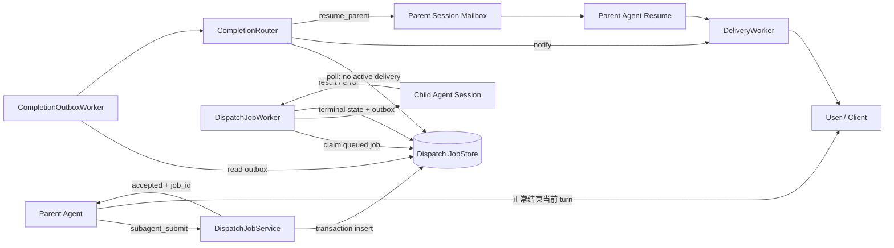
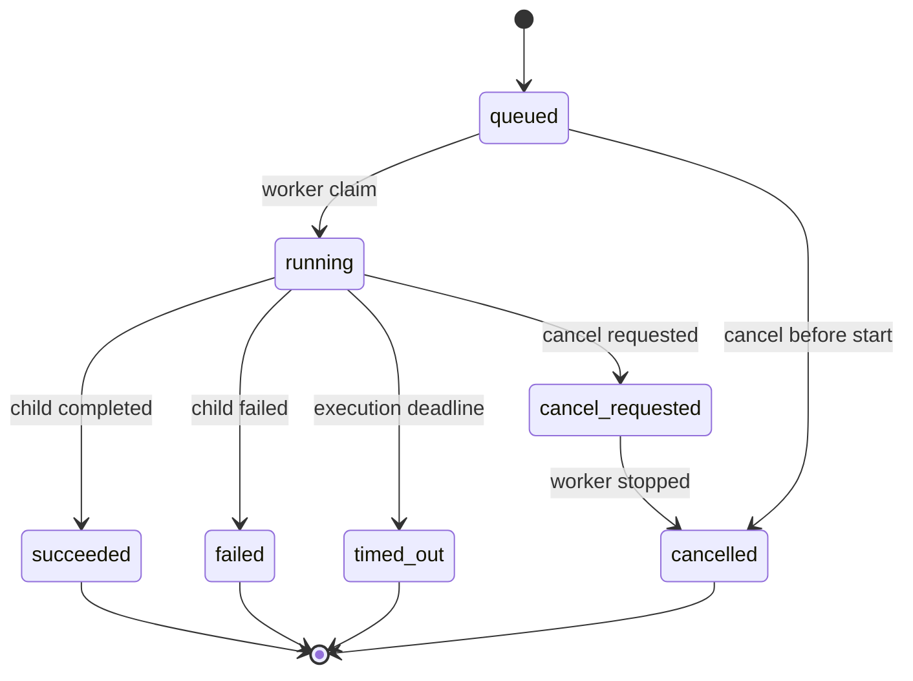

# 子 Agent 长任务异步调度设计方案

> 状态：Draft  
> 适用范围：`src/mybot` 编排与运行时层  
> 不涉及：`research_assistant` 领域服务内部实现

## 1. 背景

当前 `subagent_dispatch` 虽然通过 EventBus 把 Child 任务交给 `AgentWorker`，但 Parent 的工具调用会一直等待 `DispatchResultEvent`。因此，它在 Python 实现上是异步 I/O，在产品和工具协议上仍然是同步 RPC：

1. Parent 发起 `subagent_dispatch`。
2. 工具创建 Child Session 和内存 `Future`。
3. Parent 持有当前 Agent 执行槽并等待 Child 完成。
4. Child 返回后，工具才把结果写回 Parent 的 Tool Message。
5. Parent 继续调用 LLM，生成最终回复。

这个模式适合秒级短任务，但不适合分钟级或更长的研究、批处理和外部系统任务。长任务会导致 Parent 响应延迟、占用并发槽，并且任务状态依赖进程内存，无法可靠恢复。

本方案将长任务演进为“持久化异步任务 + poll/push 双消费”，并保留短任务同步兼容路径。

## 2. 现状与问题定位

### 2.1 同步等待链路

- [`subagent_tool.py`](../src/mybot/tools/subagent_tool.py) 创建 `result_future`，订阅 `DispatchResultEvent`，随后使用 `asyncio.wait_for()` 等待结果。
- [`agent.py`](../src/mybot/core/agent.py) 的 `_handle_tool_calls()` 使用 `asyncio.gather()` 等待所有工具返回；只要一个 Child 未完成，Parent 的当前 turn 就不会继续。
- [`agent_worker.py`](../src/mybot/server/agent_worker.py) 在 `async with sem` 内执行完整的 `session.chat()`，因此 Parent 等待 Child 时仍占用 Parent Agent 的并发配额。

### 2.2 任务状态不持久

- `job_id` 只存在于事件和返回 JSON 中，没有可查询的 JobStore。
- Child 的 `asyncio.Task` 只保存在 `AgentWorker._dispatch_tasks` 内存字典中。
- EventBus 目前只持久化 `OutboundEvent`，`DispatchEvent` 和 `DispatchResultEvent` 在进程退出后会丢失。
- Parent 等待结果依赖临时订阅者；进程重启后无法重建 Future 和订阅关系。

### 2.3 Push 基础设施不完整

- Telegram 和 Discord 可以通过父会话记录的 `source` 定向回复。
- WebSocket 当前向所有连接广播事件，不满足任务结果的用户隔离要求。
- CLI 假设“一次输入对应一次同步回复”，不能正确展示先返回的 accepted 消息和稍后到达的完成通知。

### 2.4 会话并发风险

当前并发限制以 `agent_id` 为粒度，没有以 `session_id` 为粒度串行化。同一 Parent Session 的用户新消息和 Child 完成回调如果同时触发，会分别加载历史并并发写入，可能导致：

- 消息顺序与实际发生顺序不一致；
- 两个 LLM turn 读取到相同的旧上下文；
- 重复或互相覆盖语义上的最终回复；
- 完成通知被错误地关联到另一轮用户请求。

## 3. 设计目标

### 3.1 必须实现

1. `submit` 在持久化任务后快速返回，不等待 Child 完成。
2. Parent 在回复“任务已提交”后释放当前执行槽。
3. 支持按 `job_id` 查询状态、获取结果和请求取消。
4. 支持任务完成后定向通知原始用户。
5. 可选地唤醒 Parent，由 Parent 读取 Child 结果并生成最终回复。
6. 进程重启后，已提交任务仍可查询，未开始任务可以继续调度。
7. 重复 Tool Call 或请求重放不能重复创建 Child 任务。
8. 同一个 Parent Session 的所有 turn 严格串行执行。
9. 保持现有 Agent 工具白名单和 `dispatch_to` 授权模型。

### 3.2 非目标

第一阶段不追求以下能力：

- 跨数据中心的分布式任务调度；
- 对包含任意副作用的 Child 实现严格 exactly-once 执行；
- 百分比进度自动推断；
- 动态 Agent 拓扑或不受限制的递归委派；
- 使用 EventBus 替代专业消息队列。

## 4. 核心设计决策

| 决策 | 选择 | 原因 |
| --- | --- | --- |
| 任务事实来源 | 独立 SQLite JobStore | 当前运行时以单进程为主；SQLite 支持事务、条件更新、索引和重启恢复 |
| EventBus 定位 | 实时唤醒和进程内通知 | 当前 EventBus 不是可靠队列，不能单独承担任务持久性 |
| 长任务协议 | `submit/status/cancel` | 明确区分提交和等待，避免工具语义继续同步化 |
| 短任务兼容 | 保留 `subagent_dispatch` | 避免破坏现有 Agent 配置和调用习惯 |
| Push 路由键 | `parent_session_id` | 父会话已经持久化原始平台 `source`，可复用 DeliveryWorker |
| Parent 自动续跑 | 独立 `resume_parent` 模式 | 直接通知和 Parent 再推理的成本、风险与语义不同，不应混为一种行为 |
| 任务恢复 | queued 自动恢复；running 按策略处理 | 避免进程崩溃后盲目重放有副作用的 Child |
| 外部投递语义 | at-least-once + 客户端去重 | Telegram、Discord、WebSocket 无法提供端到端 exactly-once |

## 5. 目标架构



核心原则：

- JobStore 保存任务状态和结果，是唯一事实来源。
- EventBus 中的事件只携带 `job_id`、路由信息和结果引用，不携带不可恢复的唯一状态。
- Worker 即使错过 EventBus 唤醒，也能通过周期扫描 JobStore 继续工作。
- 任务状态变更与 completion outbox 写入同一事务，避免“任务完成但通知永久丢失”。

## 6. 任务消费模式

### 6.1 `poll`

适用于 CLI、ACP、无长连接客户端或不希望主动通知的调用方。

流程：

1. Parent 调用 `subagent_submit`，收到 `job_id`。
2. Parent 向用户返回 accepted 响应。
3. 用户后续询问，或上层客户端调用状态接口。
4. `subagent_status` 从 JobStore 返回当前状态；终态时附带结果。

限制：Parent 不应在同一个 LLM turn 中循环轮询，否则仍然是同步等待，并额外增加模型调用成本。

### 6.2 `notify`

适用于结果可以直接展示、不需要 Parent 再加工的任务。

流程：

1. Submit 立即返回。
2. Child 完成后，CompletionRouter 以 `parent_session_id` 创建 `OutboundEvent`。
3. DeliveryWorker 从父会话恢复原始平台 `source`，定向发送结果。

该模式不再次调用 Parent LLM，延迟和成本最低，建议作为异步任务的第一阶段默认 Push 方式。

### 6.3 `resume_parent`

适用于 Child 只是中间结果，仍需 Parent 合并多个结果、执行判断或生成面向用户的最终答案。

流程：

1. Child 完成后创建 `JobCompletedEvent`。
2. Parent Session Mailbox 按会话顺序接收该事件。
3. Parent 从 JobStore 读取 Child 结果。
4. 运行一个新的内部 Parent turn。
5. Parent 生成最终 `OutboundEvent`。

这是一个新的 turn，不是恢复原来阻塞的 Python 调用栈。原 submit Tool Call 已经在之前的 turn 中以 accepted Tool Result 正常闭合。

## 7. 状态机

### 7.1 状态定义

| 状态 | 含义 |
| --- | --- |
| `queued` | 已持久化，等待 Worker claim |
| `running` | 已被 Worker claim，Child 正在运行 |
| `cancel_requested` | 取消请求已接受，等待 Worker 停止 |
| `succeeded` | 成功完成，结果已持久化 |
| `failed` | 执行失败，错误已持久化 |
| `cancelled` | 已取消且不会再产生有效结果 |
| `timed_out` | 超过 Child 执行期限 |

### 7.2 状态转换



终态是 `succeeded`、`failed`、`cancelled` 和 `timed_out`。终态不可再次转换。

### 7.3 取消与完成竞态

状态转换必须使用事务内的 compare-and-set：

- 如果 `running -> succeeded` 先提交，后续取消返回 `already_terminal`。
- 如果 `running -> cancel_requested` 先提交，Worker 不得再提交成功结果；晚到的结果可以写审计日志，但不能改变终态。
- 同一任务只能创建一次 terminal completion outbox 记录。

## 8. 数据模型

建议新增独立的 SQLite 数据库，默认位置为：

```text
<workspace>/.event/dispatch.db
```

### 8.1 `dispatch_jobs`

| 字段 | 类型 | 说明 |
| --- | --- | --- |
| `job_id` | TEXT PK | UUID/UUIDv7 |
| `idempotency_key` | TEXT | Tool Call 的稳定幂等键 |
| `parent_session_id` | TEXT | 父会话 |
| `parent_agent_id` | TEXT | 发起委派的 Agent |
| `target_agent_id` | TEXT | Child Agent |
| `child_session_id` | TEXT | Child 独立会话 |
| `status` | TEXT | 任务状态 |
| `completion_mode` | TEXT | `poll`、`notify` 或 `resume_parent` |
| `request_json` | TEXT | task/context 等规范化请求 |
| `result_json` | TEXT NULL | 成功结果或结果引用 |
| `error_code` | TEXT NULL | 稳定、低基数错误码 |
| `error_message` | TEXT NULL | 可诊断错误文本 |
| `execution_deadline_at` | TEXT | Child 执行期限 |
| `lease_owner` | TEXT NULL | Worker claim 标识 |
| `lease_expires_at` | TEXT NULL | Worker lease 期限 |
| `attempt_count` | INTEGER | 执行尝试次数 |
| `version` | INTEGER | 乐观并发版本 |
| `created_at` | TEXT | 创建时间 |
| `started_at` | TEXT NULL | 开始时间 |
| `completed_at` | TEXT NULL | 终态时间 |

约束和索引：

- `UNIQUE(parent_session_id, idempotency_key)`；
- `INDEX(status, created_at)`，供 Worker claim；
- `INDEX(parent_session_id, created_at)`，供会话查询；
- `UNIQUE(child_session_id)`；
- `status` 和 `completion_mode` 使用 CHECK 约束。

### 8.2 `dispatch_outbox`

| 字段 | 说明 |
| --- | --- |
| `event_id` | 全局唯一事件 ID |
| `job_id` | 对应任务 |
| `event_type` | `job.completed` 等稳定类型 |
| `payload_json` | 小型通知载荷，只保存引用和路由信息 |
| `created_at` | 创建时间 |
| `published_at` | 成功发布到 EventBus 的时间 |
| `attempt_count` | 发布次数 |
| `next_attempt_at` | 下次重试时间 |

任务进入终态和 outbox 插入必须位于同一个数据库事务中。

## 9. 组件职责

### 9.1 `DispatchJobRepository`

只负责持久化：创建、读取、条件状态转换、claim、lease、结果保存、outbox 和清理。不包含 Agent 或渠道逻辑。

### 9.2 `DispatchJobService`

负责领域规则：

- 校验 `dispatch_to`；
- 生成 Child Session；
- 构造幂等键；
- 检查父会话任务配额；
- 提交、查询和取消；
- 将内部状态映射为稳定 Tool Result。

### 9.3 `DispatchJobWorker`

负责执行：

- 从 JobStore claim `queued` 任务；
- 使用目标 Agent 的 `max_concurrency`；
- 创建或恢复 Child Session；
- 定期续租 lease；
- 执行 Child turn；
- 写入成功、失败、取消或超时终态。

EventBus 的任务事件只能作为立即唤醒信号。Worker 仍需周期扫描，避免事件丢失导致任务永久停留在 `queued`。

### 9.4 `CompletionOutboxWorker`

读取未发布 outbox，以指数退避发布 completion 事件。发布成功后记录 `published_at`。EventBus/消费者必须使用 `event_id` 去重。

### 9.5 `CompletionRouter`

按 `completion_mode` 分流：

- `poll`：不主动发送；
- `notify`：生成父会话 `OutboundEvent`；
- `resume_parent`：写入 Parent Session Mailbox。

### 9.6 `ParentSessionMailbox`

为每个 `session_id` 提供串行事件消费。用户 `InboundEvent`、Job Completion 和其他会话级触发都必须经过同一入口，不能分别直接创建并发的 `exec_session()`。

单进程 MVP 可以使用 `session_id -> asyncio.Lock/Queue`。如果未来运行多个 AgentWorker 进程，应升级为数据库 lease 或外部队列分区，保证同一 Session 同时只有一个消费者。

## 10. Tool 协议

### 10.1 `subagent_submit`

请求示例：

```json
{
  "agent_id": "researcher",
  "task": "调研 RAG 评估方法并附来源",
  "context": "重点关注生产环境",
  "completion_mode": "notify"
}
```

返回示例：

```json
{
  "ok": true,
  "job_id": "0199...",
  "status": "queued",
  "completion_mode": "notify",
  "child_session_id": "...",
  "submitted_at": "2026-09-14T10:00:00+08:00"
}
```

`completion_mode` 的可选值必须受 Agent 配置约束，不能由模型绕过平台或安全策略。

### 10.2 `subagent_status`

运行中：

```json
{
  "ok": true,
  "job_id": "0199...",
  "status": "running",
  "started_at": "2026-09-14T10:00:02+08:00",
  "next_poll_after_seconds": 5
}
```

成功：

```json
{
  "ok": true,
  "job_id": "0199...",
  "status": "succeeded",
  "result": {
    "content": "..."
  },
  "completed_at": "2026-09-14T10:04:20+08:00"
}
```

大结果应返回 `result_ref` 和受限摘要，避免把超大 Child 输出直接塞入 Parent 上下文。

### 10.3 `subagent_cancel`

```json
{
  "ok": true,
  "job_id": "0199...",
  "status": "cancel_requested"
}
```

若任务已经进入终态，返回当前终态和稳定错误码 `already_terminal`，不能假装取消成功。

### 10.4 同步兼容工具

保留 `subagent_dispatch`，但内部改为：

1. 调用与 `subagent_submit` 相同的 JobService；
2. 最多等待较短的 `sync_wait_seconds`；
3. 等待期内完成则返回原有结构化结果；
4. 超过等待期不取消 Child，而是返回 `accepted`、`job_id` 和当前状态；
5. 只有显式配置 `cancel_on_sync_timeout` 时才保持旧的超时取消语义。

这样可以逐步迁移旧 Agent，而不会让短任务无条件承担异步交互成本。

## 11. Tool 执行上下文与幂等性

当前 Tool 只收到 `session` 和模型参数。异步提交需要额外的稳定执行上下文：

```text
ToolExecutionContext
  session_id
  turn_id
  tool_call_id
  agent_id
  source
```

推荐幂等键：

```text
sha256(parent_session_id + ":" + tool_call_id)
```

同一个 Tool Call 因网络重试、恢复或消息重放再次执行时，JobService 返回已有任务，不创建第二个 Child Session。

为了阻止忙轮询：

- 同一 `turn_id` 对刚提交任务的首次 status 查询只返回 `deferred=true`；
- 同一 turn 内重复 status 查询返回相同快照；
- AgentSession 增加每轮最大 Tool Round 限制，防止模型无限调用工具；
- Prompt 明确要求提交后先向用户返回 `job_id`，不得在当前 turn 等待完成。

## 12. Event 协议

### 12.1 调度唤醒事件

保留或替换现有 `DispatchEvent` 时，事件只需携带：

```json
{
  "type": "DispatchQueuedEvent",
  "job_id": "0199...",
  "session_id": "child-session-id",
  "timestamp": 0
}
```

完整 task/context 从 JobStore 加载，防止事件和数据库出现两个不一致的数据来源。

### 12.2 完成事件

```json
{
  "type": "JobCompletedEvent",
  "event_id": "...",
  "job_id": "0199...",
  "session_id": "parent-session-id",
  "child_session_id": "child-session-id",
  "status": "succeeded",
  "result_ref": "dispatch-job:0199...",
  "source": "agent:researcher",
  "timestamp": 0
}
```

这里的 `session_id` 明确表示要投递或恢复的 Parent Session。Child Session 通过单独字段保留，便于追踪。

## 13. Parent 恢复语义

不能在 Child 完成后，向原始 submit `tool_call_id` 再追加第二个 Tool Message。原 Tool Call 已经由 accepted Tool Result 闭合，重复 Tool Result 会形成不合法或含糊的模型对话历史。

`resume_parent` 应创建一个新的内部 turn。建议由编排器向历史加入一组可审计、协议完整的内部消息：

1. 一个标记为 runtime-generated 的 synthetic assistant tool call，例如 `subagent_result_ready(job_id)`；
2. 一个与新 tool call id 匹配的 Tool Message，内容来自 JobStore；
3. 调用 Parent LLM 继续生成面向用户的回复。

History 模型需要为 runtime-generated 消息保存 `metadata`，至少记录 `event_id`、`job_id` 和 `synthetic=true`。Child 结果必须作为工具数据处理，不能直接提升为 System Prompt，避免外部研究内容中的提示注入获得更高指令优先级。

同一个 `event_id` 只允许恢复 Parent 一次。消费记录应持久化，不能只依赖内存集合。

## 14. 超时、取消与重启恢复

### 14.1 分离两类超时

- `sync_wait_seconds`：同步兼容工具最多等待多久。
- `execution_timeout_seconds`：Child 任务最多执行多久。

当前 `dispatch_timeout_seconds` 不应被静默改变含义。迁移期将其保留为同步等待配置，并新增独立的执行期限配置。

### 14.2 Parent 取消

异步 submit 成功后，Parent turn 与 Child 生命周期已经解耦。Parent turn 被取消或客户端断开时，Child 默认继续运行。需要取消时必须调用 `subagent_cancel`。

同步兼容路径可以保留“Parent 取消传播到 Child”的旧行为，但应由配置明确控制。

### 14.3 Worker 重启

- `queued`：启动后自动重新 claim。
- `running` 且 lease 有效：等待 lease 到期，防止双 Worker 并发执行。
- `running` 且 lease 过期：默认标记 `failed/worker_lost`，不自动重放。
- 只有目标 Agent 声明 `retry_safe=true` 时，才允许将 lease 过期任务重新排队。

这是因为通用 Child 未来可能拥有写文件、发消息等副作用，盲目重放无法保证 exactly-once。当前只读 researcher 可以显式声明为可安全重试。

## 15. Push 与渠道适配

### 15.1 Telegram / Discord

CompletionRouter 使用 `parent_session_id` 生成 `OutboundEvent`。DeliveryWorker 继续从 HistoryStore 读取父会话的原始平台 `source`，无需把平台令牌或用户标识复制到任务表。

### 15.2 WebSocket

当前广播模型必须改为定向连接注册表：

```text
source string -> set[WebSocket connection]
```

只向与 Parent Session `source` 匹配的连接发送任务事件。客户端使用 `event_id` 或 `job_id + status` 去重。断线期间的完成结果仍保存在 JobStore，重连后可以 poll。

### 15.3 CLI

提供两种可选实现：

- 第一阶段默认 `poll`，增加 `/jobs`、`/job <id>` 和 `/cancel <id>`；
- 后续增加独立的异步输出消费协程，在 Rich Prompt 之外安全打印 completion。

不能继续用一个 FIFO `response_queue` 把下一条任意 Outbound 当作当前输入的唯一响应，否则 accepted 与 completion 会发生错配。

### 15.4 ACP 或无 Push 客户端

默认使用 `poll`。如果协议上层提供通知能力，可在适配层把 `JobCompletedEvent` 映射为对应通知，不应让核心调度层依赖具体协议。

## 16. 权限与安全

1. Submit 继续校验 Parent Agent 的 `dispatch_to`，不能只相信 Tool 参数。
2. `status` 和 `cancel` 默认仅允许任务的 `parent_session_id` 调用。
3. 运维级跨会话查询需要独立管理权限，不复用 Agent Tool。
4. `completion_mode` 必须在 Agent 允许列表内。
5. 限制每个父会话的 pending 数、每个目标 Agent 的 queued 数和请求体大小。
6. Child 结果是非可信数据；Notify 时应进行大小限制和平台转义，Resume 时应保持 Tool 数据语义。
7. WebSocket 在启用 Push 前必须完成身份认证、连接隔离和来源绑定。
8. 日志不得记录完整 task/context/result，以免泄露用户内容；使用 `job_id` 关联详细审计。

## 17. 背压与资源控制

新增以下限制：

- `max_pending_jobs_per_session`；
- `max_queued_jobs_per_agent`；
- `max_result_bytes`；
- `job_retention_hours`；
- `poll_min_interval_seconds`；
- `outbox_max_attempts`；
- Child Agent 继续服从现有 `max_concurrency`。

达到配额时，Submit 返回稳定结构化错误：

```json
{
  "ok": false,
  "error": {
    "code": "queue_capacity_exceeded",
    "message": "target agent queue is full",
    "retry_after_seconds": 30
  }
}
```

不能先创建无上限任务，再依赖 asyncio Task 和内存队列吸收压力。

## 18. 配置建议

建议增加全局 dispatch 配置：

```yaml
dispatch:
  store_url: sqlite:///.event/dispatch.db
  scan_interval_seconds: 1
  lease_seconds: 60
  default_execution_timeout_seconds: 3600
  sync_wait_seconds: 20
  cancel_on_sync_timeout: false
  max_pending_jobs_per_session: 10
  max_queued_jobs_per_agent: 100
  max_result_bytes: 1048576
  job_retention_hours: 168
  poll_min_interval_seconds: 5
  outbox_max_attempts: 20
```

Agent 级配置：

```yaml
tools:
  - subagent_dispatch
  - subagent_submit
  - subagent_status
  - subagent_cancel
dispatch_to: [researcher]
dispatch_completion_modes: [poll, notify, resume_parent]
default_dispatch_completion_mode: notify
dispatch_execution_timeout_seconds: 3600
retry_safe: false
```

`retry_safe` 更适合作为目标 Agent 的声明；只有工具集合和执行语义都可重放时才能开启。

## 19. 可观测性

日志、Trace 和 Metric 都使用 `job_id`、`parent_session_id`、`child_session_id` 关联，但指标标签只使用低基数字段。

建议指标：

| 指标 | 类型 | 标签 |
| --- | --- | --- |
| `dispatch_jobs_total` | Counter | target_agent, terminal_status, completion_mode |
| `dispatch_queue_latency_seconds` | Histogram | target_agent |
| `dispatch_run_duration_seconds` | Histogram | target_agent, terminal_status |
| `dispatch_jobs_active` | Gauge | target_agent, status |
| `dispatch_recovery_total` | Counter | action |
| `dispatch_outbox_delivery_total` | Counter | event_type, status |
| `dispatch_parent_resume_total` | Counter | status |

关键日志事件：submitted、claimed、started、cancel_requested、terminal、outbox_published、notification_delivered、parent_resumed 和 recovery_decision。

## 20. 兼容与迁移方案

### 阶段 0：补齐测试保护

- 固化现有同步 `subagent_dispatch` 成功、错误、超时和取消行为。
- 增加同一 Parent Session 并发输入测试，暴露当前顺序风险。

### 阶段 1：持久化任务底座

- 新增 JobRepository、JobService、SQLite migration 和状态机测试。
- 新增 Worker claim、lease、终态写入和启动恢复。
- 现有 `subagent_dispatch` 内部切换到 JobService，但对外响应保持兼容。

### 阶段 2：Submit/Poll MVP

- 增加 `subagent_submit`、`subagent_status` 和 `subagent_cancel`。
- 增加 ToolExecutionContext 和幂等键。
- 增加队列容量、结果大小、轮询频率和每轮 Tool Round 限制。
- CLI/ACP 先使用 poll。

### 阶段 3：定向 Notify

- 增加 completion outbox 和 CompletionRouter。
- Telegram/Discord 使用父会话 source 推送。
- WebSocket 改成认证后的 source 定向投递。
- 客户端按 `event_id` 去重，并支持断线后 poll 补偿。

### 阶段 4：Resume Parent

- 增加 Parent Session Mailbox 和 session 级串行化。
- 增加 runtime-generated 历史元数据及 synthetic tool-call/tool-result 对。
- 增加 Parent 恢复消费幂等记录。
- 验证用户新消息与完成事件同时到达时的顺序。

### 阶段 5：默认策略迁移

- 短任务继续使用 `subagent_dispatch`。
- 预计超过 `sync_wait_seconds` 的任务使用 `subagent_submit`。
- 观察队列时延、失败率和 Push 成功率后，再考虑把复杂研究任务默认改成异步。

## 21. 测试方案

### 21.1 单元测试

- 合法与非法状态转换；
- 同一幂等键只创建一个任务；
- claim 和 lease 竞争只有一个 Worker 成功；
- 取消与完成竞态只有一个终态；
- terminal state 与 outbox 同事务提交；
- status/cancel 的会话所有权校验；
- 结果大小和 pending 配额限制；
- 同一 turn 重复 poll 被限制。

### 21.2 集成测试

- Child 被阻塞时，Submit 仍快速返回 queued；
- Parent accepted 回复完成后释放 Agent Semaphore；
- Worker 执行 Child 并将结果持久化；
- Notify 使用 Parent Session，而不是 Child Session 投递；
- Resume Parent 恰好执行一次；
- 同一 Parent Session 的 completion 与用户输入串行处理；
- 进程重启后 queued job 被恢复；
- lease 过期的非 retry-safe job 被标记为 `worker_lost`；
- Outbox 发布失败后重试，消费者按 `event_id` 去重；
- WebSocket 用户之间不能看到彼此的任务事件。

### 21.3 兼容测试

- 现有 `subagent_dispatch` 短任务返回格式保持兼容；
- 同步等待超时后返回 `job_id`，且默认不取消后台 Child；
- 旧 `AGENT.md` 未声明新工具时行为不变；
- 原有工具白名单和 `dispatch_to` 测试继续通过。

## 22. 验收标准

满足以下条件后，可认为长任务异步调度完成：

1. Child 持续运行数分钟时，Parent 能在正常一次 LLM 回复时间内返回 accepted 和 `job_id`。
2. accepted 回复后，Parent Agent 的并发槽不再被 Child 占用。
3. 所有任务都可以查询到明确状态，不存在仅保存在 Future 或 Task 中的唯一状态。
4. 服务重启后，queued job 可恢复，running job 有明确恢复决策。
5. 同一 Tool Call 重放不会创建多个 Child。
6. 取消与完成竞态不会产生两个终态或两份 completion。
7. Notify 不会跨用户或跨 WebSocket 连接泄露。
8. Push 丢失时，用户仍可以通过 poll 获取最终结果。
9. Parent Resume 与用户输入不会并发修改同一会话历史。
10. 同步兼容、poll、notify 和 resume_parent 四条路径均有端到端测试。

## 23. 不建议的实现方式

### 23.1 只把 `await` 改成 `asyncio.create_task`

这只能让工具提前返回，无法提供查询、取消、重启恢复、幂等和结果投递；进程退出后任务及结果会直接丢失。

### 23.2 让 Parent 在当前 turn 内持续 poll

这仍然占用 Parent turn 和模型调用预算，本质是更昂贵的同步等待。

### 23.3 只持久化 `DispatchResultEvent`

结果事件不能表达完整任务状态、claim、lease、取消竞态和幂等关系。事件投递记录也不应替代任务事实表。

### 23.4 Child 完成后复用原 submit Tool Call ID

原 Tool Call 已经由 accepted 结果闭合。再次追加 Tool Result 会破坏模型消息协议和历史可解释性。

### 23.5 未做连接隔离就启用 WebSocket Push

当前广播行为会把任务、状态和结果发送给无关连接，必须先完成 source 到连接的定向映射与认证。

## 24. 最终建议

推荐按以下优先级实施：

1. 先完成 JobStore、状态机、幂等、恢复和 session 串行化等可靠性底座。
2. 首先交付 `submit/status/cancel + poll`，它不依赖渠道能力，容易验证。
3. 然后交付定向 `notify`，满足大多数长任务完成提醒。
4. 最后实现 `resume_parent`，用于确实需要 Parent 二次推理的复杂编排。
5. 保留同步 `subagent_dispatch` 处理短任务，但缩短等待上限，并基于同一个 JobService 实现，避免维护两套调度逻辑。

最终形态不是在 submit/poll 和 push 之间二选一，而是以持久化 submit 为统一底座，由 poll、notify 和 resume_parent 按调用场景消费同一个任务结果。
