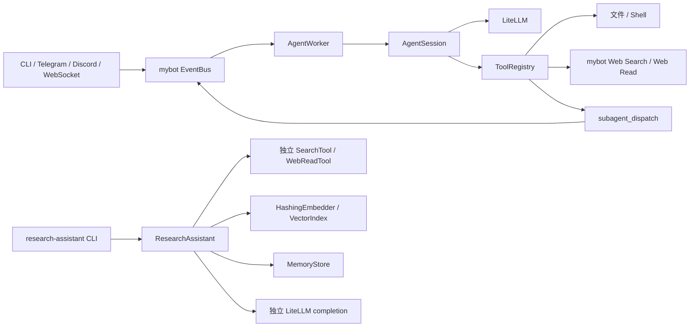
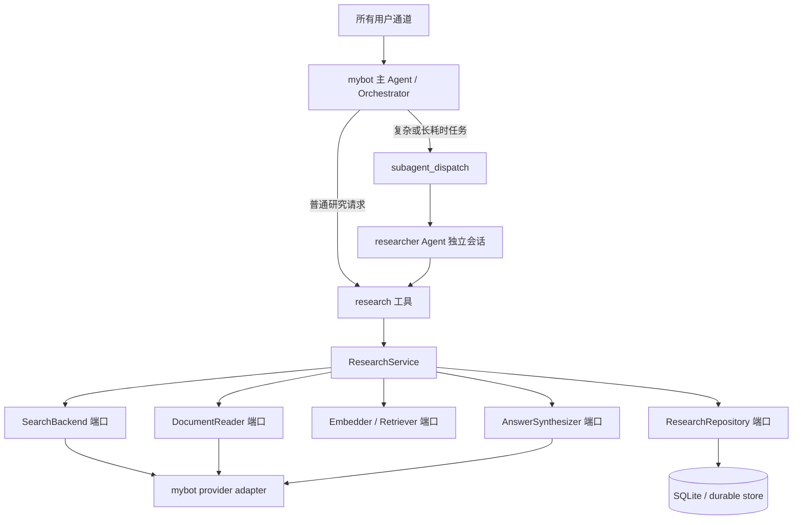

# project 项目分析与整合方案

## 1. 结论

当前仓库不是一个已经联动的双 Agent 系统，而是两个放在同一 Python 包中的独立实现：

- `mybot` 是通用 Agent 运行时，负责通道接入、会话、事件总线、工具调用、路由、定时任务和子 Agent 调度。
- `research_assistant` 是研究工作流，负责搜索、网页读取、分块、向量检索、答案生成、引用和简单持久化记忆。

推荐的目标形态是：**同一运行时、能力分层、按需委派**。

1. `mybot` 保持唯一的入口和编排运行时。
2. `research_assistant` 保持独立包，但收敛为可注入的领域服务，不再自建一套重复的搜索、网页读取和 LLM 配置。
3. 第一阶段将研究能力注册成 `mybot` 的 `research` 工具。这是默认方案，链路短、容易测试，也不会额外消耗一次 Agent 决策。
4. 第二阶段增加 `researcher` Agent。主 Agent 仅在复杂、耗时或需要隔离上下文的任务中通过现有 `subagent_dispatch` 委派给它；`researcher` 内部仍调用同一个 `research` 工具。

不建议把两个目录直接合并，也不建议让两个独立进程通过 HTTP 互调作为第一版。当前它们在同一个部署单元中，进程内接口更简单，等到确实需要独立扩缩容时再拆服务。

## 2. 当前结构和调用链



两个系统现在只共享依赖和仓库，没有共享配置、工具协议、记忆、运行状态或调用链。README 也明确把“移植为工具或 researcher 子 Agent”留作下一步。

`mybot` 已经具备联动所需的大部分基础设施：

- [`Agent._build_tools()`](../src/mybot/core/agent.py) 统一构造每个会话的工具注册表。
- [`create_subagent_dispatch_tool()`](../src/mybot/tools/subagent_tool.py) 能发现其他 Agent，并通过事件总线异步委派。
- [`AgentWorker`](../src/mybot/server/agent_worker.py) 能根据子 Agent 会话恢复对应 Agent 并执行任务。
- [`ResearchAssistant.research()`](../src/research_assistant/assistant.py) 已经是一个边界清晰的异步入口，适合包装为工具。

## 3. 做得较好的部分

- `mybot` 的事件、通道、会话、Agent 定义和工具注册职责大体分开，扩展点清楚。
- 子 Agent 使用独立会话，并在返回值中保留 `session_id`，具备继续追问和审计的基础。
- 研究报告将 `SourceDocument`、`Chunk` 和 `ResearchReport` 分开，引用编号来自真实抓取结果，没有凭空构造 URL。
- 网页读取使用 `asyncio.gather` 并发执行，且对搜索失败、空结果和网页读取失败有显式 warning。
- 依赖已经锁定在 `uv.lock` 中；本次检查时 3 个现有测试全部通过。
- `mybot` 的 LLM 层已经使用 LiteLLM `acompletion`，符合当前异步 Python SDK 用法。

## 4. 优先改进项

### P0：先处理安全边界

1. **远程输入默认拥有文件和 Shell 工具。**

   [`ToolRegistry.with_builtins()`](../src/mybot/tools/registry.py) 为所有 Agent 注册 `read`、`write`、`edit` 和 `bash`，而 [`Agent._build_tools()`](../src/mybot/core/agent.py) 无条件调用它。只要 Telegram、Discord 或 WebSocket 对外开放，提示注入就可能转化为任意命令执行或任意文件访问。

   建议把 `AgentDef` 增加显式工具白名单，例如 `tools: [research, websearch]`；默认不启用 `bash` 和写文件。文件工具必须限制在 workspace 内，Shell 工具需要独立沙箱、超时、输出上限和审计。通道侧的用户白名单不能代替工具授权。

2. **网页读取存在 SSRF 风险。**

   [`research_assistant.tools.WebReadTool`](../src/research_assistant/tools.py) 接受任意 URL 并自动跟随重定向，可能访问回环地址、内网服务或云元数据地址。应只允许 `http/https`，解析并阻止 loopback、private、link-local 和保留地址；每次重定向后重新校验，限制响应体大小和允许的内容类型。

3. **密钥配置不应长期明文写在工作区 YAML。**

   `mybot` 的 `LLMConfig.api_key` 和 Brave 配置要求直接提供字符串。建议支持 `${ENV_VAR}` 或 `SecretStr`，日志和校验错误中做脱敏，并提供 `.env.example` 而不是真实密钥示例。

### P1：修复正确性和可靠性

1. **重复研究可能完全不搜索。**

   [`MemoryStore.remember_query()`](../src/research_assistant/memory.py) 把历史查询当成永久去重集合；[`_make_queries()`](../src/research_assistant/assistant.py) 会过滤掉所有曾经出现的查询。同一主题第二次运行时可能得到空查询，最终报告“没有可读来源”。

   历史 query 应作为缓存元数据，不应决定本次是否执行。去重只在单次 research run 内进行；跨运行缓存需要 TTL、结果快照和 `force_refresh`。

2. **中文分块和检索效果很弱。**

   [`chunk_text()`](../src/research_assistant/rag.py) 按空格计数。连续中文正文可能被当成一个“word”，导致整篇文档不分块。[`TOKEN_RE`](../src/research_assistant/embeddings.py) 也可能把整段连续中文当成单个 token，特征哈希很难形成有效语义匹配。

   教学版本至少应按字符/句子兼容中英文分块；生产版本使用 tokenizer 计算 token 数，并换成多语言 embedding。检索增加最小分数、MMR/去重和可选 rerank。

3. **异步研究流程中存在同步 LLM 调用。**

   [`synthesize_answer()`](../src/research_assistant/llm.py) 在 `async research()` 内调用同步 `litellm.completion`，会阻塞事件循环。应改成异步函数并使用 `await litellm.acompletion(...)`。Context7 检索到的当前 LiteLLM 文档同样以 `acompletion` 作为异步调用接口。

4. **子 Agent 委派没有超时、取消或任务追踪。**

   [`subagent_dispatch`](../src/mybot/tools/subagent_tool.py) 会无限等待 `result_future`。当 Worker 崩溃、事件丢失或模型挂起时，主 Agent 也会永久挂起。应增加可配置 timeout，超时后取消任务并返回结构化错误；父会话取消时应向子任务传播取消；服务关闭时应等待或取消已创建任务。

5. **重试会把原任务替换为 `.`。**

   [`AgentWorker.exec_session()`](../src/mybot/server/agent_worker.py) 失败后发布内容为 `.` 的重试事件，这会污染会话并可能让模型偏离原任务。应保留原始输入和幂等 `job_id`，仅对明确可重试错误使用指数退避；工具副作用不能盲目重放。

6. **上下文压缩的执行顺序有误。**

   [`AgentSession.chat()`](../src/mybot/core/agent.py) 先用旧 state 构建 `messages`，之后才执行 `check_and_compact`，但当前轮 LLM 调用仍使用压缩前的 `messages`。应先压缩 state，再从新 state 构建消息。

7. **文件存储缺少并发控制和损坏恢复。**

   `HistoryStore` 对共享 `index.jsonl` 执行读-改-整文件写，`MemoryStore` 也直接覆盖 JSON。多个 Agent 或任务并发时可能丢更新；JSON 损坏还会导致启动失败。短期使用进程内锁与临时文件原子替换，长期可迁移 SQLite，并通过 `session_id/topic/job_id` 建索引。

8. **引用只有格式，没有有效性校验。**

   当前只测试 Markdown 中出现 `[S1]`，没有验证答案中每个引用都存在、重要事实是否带引用、引用对应的证据是否支持该句。生成后应解析引用集合，拒绝未知 source id，并将“无引用事实”标记为低置信度或触发一次修复生成。

### P2：减少重复并改善工程性

1. **合并重复适配器，而不是合并领域包。**

   两套代码分别维护搜索、网页读取、LiteLLM 和配置。定义统一的 `SearchBackend`、`DocumentReader`、`AnswerSynthesizer` 协议，让研究服务依赖协议；由 `mybot` provider 提供实现，CLI 再提供默认实现。

2. **按 Agent 配置工具，不要按运行时全量注册。**

   `allow_skills` 之外缺少工具权限模型。增加 Agent 级 `tools` 白名单后，普通 assistant 可以拥有 `research`，researcher 只拥有只读研究工具，后台任务可以按需拥有 `post_message`。

3. **拆分生产依赖和开发依赖。**

   `pytest` 当前是运行时依赖，Telegram、Discord、FastAPI、Crawl4AI 也全部强制安装。建议使用依赖组或 extras，例如 `dev`、`server`、`channels`、`crawl`，减少安装体积和供应链暴露面。

4. **补齐可运行示例。**

   仓库没有内置可用的 `workspace/config.user.yaml` 和 `agents/*/AGENT.md`，所以 `my-bot` 不能仅凭当前 README 直接运行。增加 `examples/workspace/`、无密钥的 mock/fallback 配置、主 Agent 与 researcher Agent 示例。

5. **建立质量门禁。**

   增加 Ruff、类型检查、覆盖率阈值和 CI。优先测试编排而非继续增加纯数据类测试。

6. **修复本地环境与锁文件不一致。**

   当前 `.venv` 只安装了 editable 项目和 pytest，缺少 `httpx` 等声明的运行依赖，因此现有单元测试能通过，但导入 `ResearchAssistant` 会直接触发 `ModuleNotFoundError`。应重新执行完整 `uv sync`，并在 CI 增加 CLI `--help`、核心包 import 和无网络 mock research smoke test，避免“测试绿但程序起不来”。

## 5. 推荐整合架构



这里的关键点是：**工具是能力边界，Agent 是决策与上下文边界。** `ResearchService` 只负责完成研究，不知道 Telegram、事件总线或父 Agent；`mybot` 决定何时调用、结果送到哪里以及如何继续对话。

### 方案对比

| 方案 | 优点 | 问题 | 建议 |
| --- | --- | --- | --- |
| 直接把 `ResearchAssistant` 包成工具 | 调用短、成本低、容易测试；自然复用当前 `async research()` | 长任务会占用当前轮次；需要进度/取消机制 | **第一阶段默认方案** |
| 将 researcher 做成子 Agent | 上下文隔离、可配置独立模型、适合复杂任务和后续追问 | 多一次模型决策；当前 dispatch 缺少超时和可靠任务状态 | **第二阶段按需使用** |
| 两个独立 HTTP 服务 | 可独立扩容和部署 | 配置、认证、追踪、失败恢复都更复杂 | 当前不采用 |
| 直接合并两个源码目录 | 文件看起来更少 | 耦合运行时与领域逻辑，测试和复用更差 | 不采用 |

## 6. 建议接口

先让研究服务支持依赖注入，避免构造函数内部固定创建所有实现：

```python
from typing import Protocol


class SearchBackend(Protocol):
    async def search(self, query: str, limit: int) -> list[SearchResult]: ...


class DocumentReader(Protocol):
    async def read(self, url: str) -> SourceDocument: ...


class AnswerSynthesizer(Protocol):
    async def synthesize(
        self, topic: str, evidence: list[Chunk]
    ) -> str: ...


class ResearchService:
    def __init__(
        self,
        search: SearchBackend,
        reader: DocumentReader,
        synthesizer: AnswerSynthesizer,
        repository: ResearchRepository,
    ) -> None: ...

    async def research(self, request: ResearchRequest) -> ResearchReport: ...
```

然后在 `mybot/tools/research_tool.py` 中只做薄适配：

```python
@tool(
    name="research",
    description="Research a topic and return a cited report from retrieved sources.",
    parameters={
        "type": "object",
        "properties": {
            "topic": {"type": "string"},
            "max_sources": {"type": "integer", "minimum": 1, "maximum": 10},
            "refresh": {"type": "boolean"},
        },
        "required": ["topic"],
    },
)
async def research_tool(
    topic: str,
    session: AgentSession,
    max_sources: int = 6,
    refresh: bool = False,
) -> str:
    service = session.shared_context.research_service
    report = await service.research(
        ResearchRequest(
            topic=topic,
            max_sources=max_sources,
            refresh=refresh,
            session_id=session.session_id,
        )
    )
    return report.model_dump_json()
```

工具返回 JSON 而不是预先渲染的 Markdown，主 Agent 才能可靠地区分 `answer`、`sources`、`warnings` 和 `job_id`。CLI 层继续调用 `report.to_markdown()`，展示格式不应进入领域接口。

建议为 Agent 定义加入白名单：

```yaml
# agents/assistant/AGENT.md
---
name: Assistant
description: General assistant and user-facing orchestrator
tools: [research]
dispatch_to: [researcher]
---
先直接调用 research 工具完成普通研究；只有需要拆分多个研究方向时才委派 researcher。
```

```yaml
# agents/researcher/AGENT.md
---
name: Researcher
description: Evidence-first specialist for multi-source research
tools: [research]
dispatch_to: []
max_concurrency: 2
---
仅依据 research 工具返回的来源和证据作答，明确区分事实、推断和证据不足。
```

`dispatch_to` 应替代当前“自动发现除自己以外的所有 Agent”，以免任意 Agent 之间形成循环委派。

## 7. 分阶段实施计划

### 阶段 A：打通最短链路

1. 修复重复 query、中文分块、同步 LLM 调用和引用 ID 校验。
2. 将 `ResearchAssistant` 重命名/重构为可注入的 `ResearchService`，保留兼容外观以免 CLI 立即破坏。
3. 在 `SharedContext` 初始化一个共享 `research_service`。
4. 新建 `create_research_tool(context)` 并按 Agent 白名单注册。
5. 增加集成测试：模拟搜索、读取和 LLM，不访问真实网络；直接执行 ToolRegistry 中的 `research` 并校验结构化输出。

完成标准：在 `my-bot chat` 中提问研究主题，主 Agent 能调用工具并返回只包含有效 source id 的报告。

### 阶段 B：启用双 Agent 联动

1. 增加 `assistant` 和 `researcher` 两个 Agent 定义。
2. 将子 Agent 可见范围改成显式 `dispatch_to`。
3. 为 dispatch 加 timeout、取消、结构化错误和 `job_id`。
4. 记录 `parent_session_id -> child_session_id -> report_id`，使日志和报告可追踪。
5. 增加端到端测试：主 Agent 发起委派、researcher 调用 research 工具、结果回传父会话。

完成标准：普通请求不委派；复杂请求产生一个可追踪的子会话；失败能在限定时间内返回，不会无限等待。

### 阶段 C：生产化

1. 用 SQLite/PostgreSQL 替代并发不安全的 JSON 文件，增加研究结果缓存与 TTL。
2. 增加队列化后台 job、进度事件、取消和断点恢复；长报告完成后再通过现有 delivery worker 推送。
3. 增加 URL 安全策略、工具沙箱、资源配额、速率限制、日志脱敏和调用成本统计。
4. 根据评测集选择多语言 embedding、混合检索和 reranker，而不是只凭主观更换模型。

## 8. 建议新增测试

| 测试 | 要验证的行为 |
| --- | --- |
| 同一主题连续运行两次 | 第二次仍能搜索，或命中带 TTL 的有效缓存 |
| 中文无空格长文 | 能产生多个尺寸受控且有 overlap 的 chunk |
| 搜索部分失败 | 仍使用成功来源生成报告，并保留 warning |
| 所有网页失败 | 返回可识别的证据不足状态，不调用 LLM 编造答案 |
| 引用校验 | 拒绝不存在的 `[S99]`，报告中的来源与证据一一对应 |
| ToolRegistry 集成 | 只有获授权 Agent 能看到和执行 `research` |
| 子 Agent 超时 | 主 Agent 在期限内收到结构化 timeout，不遗留订阅者 |
| 并发研究 | memory/history 不丢数据，source id 不串任务 |
| SSRF | 拒绝 localhost、私网、link-local 和重定向到私网 |
| 工具权限 | 远程通道下默认不能执行 Shell 或访问 workspace 外文件 |

## 9. 建议的目录演进

```text
src/
├── mybot/
│   ├── core/                 # 会话、事件、路由、Agent 运行时
│   ├── provider/             # LLM / search / reader 基础设施适配器
│   └── tools/
│       └── research_tool.py  # ResearchService -> mybot tool 薄适配
└── research_assistant/
    ├── service.py            # 研究用例编排，不依赖 mybot
    ├── ports.py              # Search/Reader/Synthesizer/Repository 协议
    ├── models.py             # Request/Report/Evidence 等结构化模型
    ├── retrieval.py          # chunk/embed/retrieve/rerank
    ├── citations.py          # 引用解析和有效性校验
    ├── adapters/             # CLI 独立运行所需默认适配器
    └── cli.py
```

依赖方向必须保持为 `mybot adapter -> research_assistant domain`；`research_assistant` 不应反向 import `mybot`。这样既能放在一个应用里联动，也能在未来把研究能力拆成独立 Worker，而无需重写核心逻辑。

## 10. 最终建议

先做“**主 Agent + research 工具**”，不要一开始就把每次研究都变成两个 Agent 对话。工具调用已经足够表达确定性的研究流程，延迟、成本和故障面都更小。

当任务需要拆分研究方向、独立上下文、不同模型/权限或后台长时间执行时，再使用“**主 Agent -> researcher Agent -> research 工具**”。这不是二选一：工具提供能力复用，子 Agent 提供决策和上下文隔离，两者叠加才是这个项目最自然的最终结构。

## 11. 检查依据

- 代码检查范围：`src/mybot`、`src/research_assistant`、`tests`、`README.md`、`pyproject.toml` 和 `uv.lock`。
- 测试结果：`.venv/bin/pytest -q`，3 个测试通过。
- 复现结果：相同的 3 条候选查询第二次运行被全部过滤；2800 字无空格中文只生成 1 个 chunk。
- 环境结果：当前 `.venv` 缺少 `httpx` 等运行依赖，完整应用 smoke test 未能执行；需要先完成 `uv sync`。
- LiteLLM 当前异步调用与 tool calling 用法通过 Context7 查询官方仓库文档核对；参考 [LiteLLM async completion](https://github.com/berriai/litellm/blob/litellm_internal_staging/cookbook/LiteLLM_CometAPI.ipynb) 和 [parallel function calling](https://github.com/berriai/litellm/blob/litellm_internal_staging/cookbook/Parallel_function_calling.ipynb)。
