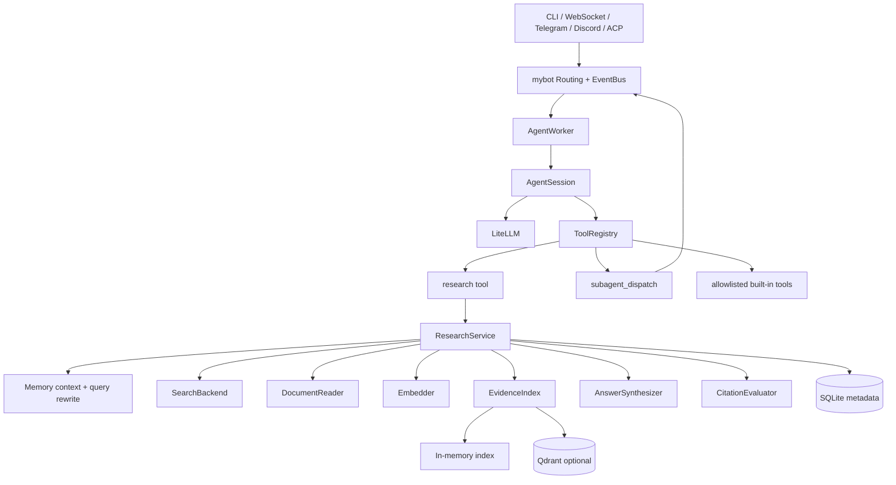

# Integrated Research Agent Runtime 项目说明

> 文档适用版本：`0.1.0`  
> Python 要求：`>= 3.11`  
> 项目包名：`stage2-research-assistant`

## 1. 项目简介

本项目是一个面向学习、原型验证和二次开发的 **可检索、可引用、可持久化的多 Agent 研究助手**。它由两个边界清晰的 Python 包组成：

- `mybot`：面向用户的 Agent 运行时，负责会话、工具调用、事件总线、路由、子 Agent、定时任务以及 CLI、WebSocket、Telegram、Discord、ACP 等接入方式。
- `research_assistant`：可独立注入的研究领域服务，负责搜索网页、读取正文、证据分块、向量检索、答案生成、引用校验、研究记忆和可观测性。

两者在集成模式下的关系是：`mybot` 是唯一的交互和编排入口，`research_assistant` 以 `research` 工具的形式向 Agent 提供研究能力。项目同时保留了 `research-assistant` 独立命令，便于不启动完整 Agent 运行时就生成研究报告。

项目的核心目标不是让模型凭内部知识直接回答，而是建立一条可追溯的证据链：

```text
研究主题
  -> 读取当前作用域的历史研究记忆
  -> 生成或改写搜索查询
  -> 搜索网页并去重 URL
  -> 复用未过期来源，或重新抓取网页
  -> 正文分块并生成向量
  -> 持久化和检索相关证据
  -> 基于证据生成带 [S1]、[S2] 引用的答案
  -> 进行 claim 级引用覆盖与支持度检查
  -> 输出答案、证据、来源、质量分数和告警
```

## 2. 已实现能力

### 2.1 Agent 运行时

- 通过 LiteLLM 接入支持 Chat Completion 与工具调用的模型。
- 使用 `AGENT.md` 定义 Agent 的名称、提示词、模型覆盖项、工具白名单和并发限制。
- 会话历史保存为 JSONL，可在不同运行之间恢复。
- 工具调用可并发执行，并在每轮模型调用前检查上下文压缩。
- 事件总线统一承载外部消息、Agent 回复和子 Agent 委派事件。
- 支持 CLI 交互、WebSocket 服务、Telegram、Discord 和 ACP stdio 接入。
- 支持 Cron 表达式定时调度 Agent，最小调度粒度为 5 分钟。
- 支持显式子 Agent 白名单、执行超时、父任务取消传播和结构化错误结果。

### 2.2 研究工作流

- Brave Search API 搜索；未配置 Brave 时可使用 DuckDuckGo HTML 搜索兜底。
- 抓取 HTML/纯文本页面并提取标题和正文。
- 对抓取目标执行 SSRF 防护：仅允许 HTTP/HTTPS，拒绝私网、回环、链路本地和保留地址，并逐次校验重定向目标。
- 限制重定向次数、响应类型和响应体大小。
- 兼容中英文文本的分块与特征哈希 embedding。
- 可选 SentenceTransformers 多语言语义 embedding。
- 默认使用内存向量索引，可选本地或远程 Qdrant。
- 使用 SQLite 保存研究运行、查询、来源版本、正文、引用和质量评估数据。
- 按内容哈希保存来源版本，并使用 TTL 判断缓存是否有效。
- 研究记忆按 `global`、`user`、`session` 作用域隔离。
- 基于检索证据生成答案；没有可用 LLM 时退化为带引用的摘录式总结。
- 检查未知引用、claim 引用覆盖率、支持率、引用准确率和矛盾率，并最多执行一次修复生成。
- 可选通过 OpenTelemetry 导出 traces 和 metrics。

### 2.3 默认安全策略

- Agent 工具采用拒绝优先策略，只有 `AGENT.md` 的 `tools` 中明确列出的工具才会注册。
- 文件工具将访问范围限制在配置的 workspace 内。
- `bash` 工具默认不存在；即使显式授权，也有 30 秒超时、20,000 字符输出上限和受限环境变量。
- 子 Agent 只能委派给 `dispatch_to` 中列出的 Agent。
- YAML 中可通过精确的 `${ENV_VAR}` 占位符读取密钥，配置对象使用 `SecretStr` 避免在 `repr` 中显示明文。

## 3. 总体架构



主要边界如下：

| 层级 | 主要职责 | 不负责的内容 |
| --- | --- | --- |
| 接入层 | 接收 CLI、平台、WebSocket、ACP 消息 | 研究逻辑和模型决策 |
| `mybot` 运行时 | 会话、路由、提示词、工具、事件、调度 | 搜索结果如何检索和评估 |
| `research` 工具适配器 | 将 Agent 工具参数转换为 `ResearchRequest` | 具体搜索、抓取和生成 |
| `ResearchService` | 编排完整研究流水线 | 平台消息投递和 UI 展示 |
| 端口与适配器 | 搜索、阅读、embedding、向量库、LLM、存储 | 跨模块业务编排 |

## 4. 研究请求执行流程

一次 `ResearchService.research()` 调用按下列顺序执行：

1. 校验并规范化 `topic`、`max_queries`、`max_sources` 和 `top_k`。
2. 在 SQLite 中创建 `research_runs` 记录，状态为 `running`。
3. 根据当前 `session_id` / `user_scope` 读取可见的历史研究运行。
4. 使用 `DeterministicQueryRewriter` 生成查询，并吸收相关历史查询作为规划线索。
5. 并发执行搜索，记录结果数量、耗时和错误类型；同一次运行内去重 URL。
6. 对每个来源检查 SQLite 中是否存在未过期版本：
   - 缓存有效且未指定 `refresh`：复用保存的正文；
   - 缓存不存在、已过期或 `refresh=True`：重新抓取并保存新版本。
7. 对文档分块，生成文档向量，并写入当前 EvidenceIndex。
8. 对研究查询生成查询向量，检索候选 chunk，按来源配额去重并截取 `top_k`。
9. 将本轮实际使用的来源绑定为稳定的报告引用编号 `[S1]`、`[S2]` 等。
10. 调用 LLM 仅根据证据生成答案；模型不可用时生成确定性的摘录式答案。
11. 将答案拆成 atomic claims，校验引用是否存在以及证据是否支持 claim。
12. 当引用质量低于阈值时尝试一次保守修复；仍不满足时将报告标为 `insufficient_evidence`。
13. 将答案、状态、来源关联和质量结果提交到 SQLite，并返回 `ResearchReport`。

`ResearchReport` 的主要字段：

| 字段 | 含义 |
| --- | --- |
| `topic` | 原始研究主题 |
| `answer` | 最终答案，事实陈述应包含来源编号 |
| `sources` | 报告引用来源及 URL |
| `evidence` | 实际参与生成和验证的文本块 |
| `warnings` | 搜索、读取、模型调用或质量检查中的非致命问题 |
| `status` | `complete` 或 `insufficient_evidence` |
| `quality` | claim 覆盖率、支持率、引用准确率、矛盾率等 |
| `run_id` / `report_id` | 研究运行和报告的追踪标识 |

## 5. 目录说明

```text
project/
├── pyproject.toml                 # 包元数据、依赖、命令入口、测试配置
├── uv.lock                        # uv 锁文件
├── .env.example                   # 环境变量示例，不会被程序自动加载
├── README.md                      # 英文快速概览
├── docs/
│   ├── PROJECT_GUIDE.zh-CN.md     # 本文档
│   ├── PROJECT_ANALYSIS_AND_INTEGRATION.md
│   └── RESEARCH_MEMORY_RAG_OBSERVABILITY_DESIGN.md
├── examples/workspace/
│   ├── config.user.yaml           # 可运行的集成配置示例
│   └── agents/
│       ├── assistant/AGENT.md     # 用户侧编排 Agent
│       └── researcher/AGENT.md    # 研究子 Agent
├── src/mybot/                     # 通用 Agent 运行时
│   ├── acp/                       # ACP JSON-RPC stdio 适配器
│   ├── channel/                   # Telegram / Discord 通道
│   ├── cli/                       # my-bot CLI 命令
│   ├── core/                      # Agent、会话、事件、路由、历史、定义加载器
│   ├── provider/                  # LiteLLM、搜索、网页阅读和研究服务组装
│   ├── server/                    # Worker、FastAPI、WebSocket、Cron 和投递
│   ├── tools/                     # 内置工具及 research / subagent 适配器
│   └── utils/                     # 配置和日志
├── src/research_assistant/        # 研究领域服务
│   ├── repositories/sqlite.py     # 元数据、来源版本和评估持久化
│   ├── vectorstores/qdrant.py     # Qdrant 证据索引
│   ├── assistant.py               # 独立 CLI 使用的兼容 facade
│   ├── service.py                 # 研究流水线编排核心
│   ├── models.py                  # 请求、来源、证据、报告和质量模型
│   ├── ports.py                   # 可替换组件协议
│   ├── tools.py                   # 默认搜索和网页读取实现
│   ├── rag.py                     # 分块、内存索引和检索后处理
│   ├── embeddings.py              # Hashing / SentenceTransformers 适配器
│   ├── claims.py                  # claim 提取、验证和质量评分
│   ├── llm.py                     # 独立模式 LLM 生成与无模型回退
│   └── telemetry.py               # OpenTelemetry 封装
└── tests/                         # 单元与集成测试
```

## 6. 环境准备与安装

### 6.1 前置条件

- Python 3.11 或更高版本；推荐 Python 3.12。
- 推荐安装 `uv`；也可以使用标准 `venv + pip`。
- 运行完整 `mybot` 对话需要一个 LiteLLM 支持的模型 API Key。
- 联网研究需要能访问搜索引擎和公开网页；Brave Key 为可选，但比 HTML 兜底更稳定。

### 6.2 使用 uv 安装

在本目录执行：

```bash
cd project
uv sync --group dev
```

启用 SentenceTransformers、Qdrant 和可观测性导出器：

```bash
uv sync --group dev --extra semantic-rag --extra observability
```

启用聊天平台或 Crawl4AI：

```bash
uv sync --extra channels --extra crawl
```

### 6.3 使用 pip 安装

```bash
cd project
python3 -m venv .venv
source .venv/bin/activate
python -m pip install -e .
```

开发依赖：

```bash
python -m pip install -e '.[semantic-rag,observability]'
python -m pip install pytest pytest-cov ruff
```

### 6.4 配置密钥

`.env.example` 仅是字段示例，当前程序**不会自动读取 `.env` 文件**。应在启动进程前导出环境变量，或由部署系统注入：

```bash
export OPENAI_API_KEY="your-openai-api-key"
export BRAVE_API_KEY="your-brave-search-api-key"
```

独立研究 CLI 还可以通过下列变量选择模型：

```bash
export LITELLM_MODEL="gpt-4.1-mini"
```

完整 `mybot` 模式以 `config.user.yaml` 中的 `llm.model` 为准，不读取 `LITELLM_MODEL` 覆盖该值。

## 7. 快速运行

### 7.1 独立研究 CLI

独立 CLI 不需要 Agent workspace，适合直接生成一份 Markdown 研究报告：

```bash
uv run research-assistant "RAG 评估的最佳实践"
```

限制查询和来源数量，并保存报告：

```bash
uv run research-assistant \
  "Model Context Protocol 的设计与应用" \
  --max-queries 3 \
  --max-sources 5 \
  --output reports/mcp.md
```

也可直接使用模块入口：

```bash
python -m research_assistant "多 Agent 系统的上下文隔离"
```

独立模式默认使用：

- DuckDuckGo HTML，或环境中存在 `BRAVE_API_KEY` 时使用 Brave；
- 384 维 HashingEmbedder；
- 单次进程内 EvidenceIndex；
- `project/data/memory/research.db` SQLite 数据库；
- 环境中没有 LLM Key 时使用摘录式回退答案。

### 7.2 集成 Agent CLI

示例 workspace 已包含 `assistant` 和 `researcher` 两个 Agent：

```bash
export OPENAI_API_KEY="your-openai-api-key"
uv run my-bot --workspace examples/workspace chat
```

指定 Agent：

```bash
uv run my-bot --workspace examples/workspace chat --agent researcher
```

默认 `assistant` 可以直接调用 `research`，也可以把复杂的多方向任务委派给 `researcher`。`researcher` 只有 `research` 工具，不能访问文件或 Shell。

### 7.3 长期运行服务

```bash
uv run my-bot --workspace examples/workspace server
```

默认启动：

- EventBus；
- AgentWorker；
- DeliveryWorker；
- CronWorker；
- WebSocketWorker；
- FastAPI/Uvicorn，监听 `127.0.0.1:8000`；
- 配置文件热重载观察器；
- 配置启用时的 Telegram / Discord ChannelWorker。

### 7.4 ACP stdio 模式

```bash
uv run my-bot --workspace examples/workspace acp
```

ACP 适配器通过标准输入输出处理逐行 JSON-RPC，支持协议版本 1 和 2，并实现 `initialize`、`session/new`、`session/load`、`session/resume`、`session/prompt`、`session/cancel` 和 `session/close`。标准输出保留给协议消息，日志写入标准错误或日志文件。

## 8. Workspace 配置

`my-bot` 从 `<workspace>/config.user.yaml` 加载用户配置，再用可选的 `config.runtime.yaml` 覆盖运行时字段。两者进行递归合并。相对路径以 workspace 为基准解析。

最小可用示例：

```yaml
llm:
  provider: openai
  model: openai/gpt-4.1-mini
  api_key: ${OPENAI_API_KEY}
  temperature: 0.2
  max_tokens: 2048

default_agent: assistant

channels:
  enabled: false

api:
  host: 127.0.0.1
  port: 8000
```

主要配置项：

| 配置路径 | 默认值 / 示例 | 说明 |
| --- | --- | --- |
| `llm.provider` | 必填 | 提供方标识，主要用于配置语义 |
| `llm.model` | 必填 | LiteLLM 模型名 |
| `llm.api_key` | 必填 | 建议使用 `${ENV_VAR}` |
| `llm.api_base` | `null` | 可选的 OpenAI 兼容 API 地址 |
| `default_agent` | 必填 | 默认 Agent 目录名 |
| `agents_path` | `agents` | Agent 定义目录 |
| `skills_path` | `skills` | Skill 定义目录 |
| `crons_path` | `crons` | 定时任务定义目录 |
| `history_path` | `.history` | 会话索引和消息 JSONL |
| `logging_path` | `.logs` | 日志目录 |
| `channels.enabled` | `false` | 是否启动平台通道 |
| `api.host` / `api.port` | `127.0.0.1:8000` | WebSocket 服务监听地址 |
| `websearch` | `null` | 配置后集成模式使用 Brave provider |
| `webread` | `null` | 可选 Crawl4AI provider 配置 |

### 8.1 研究配置

```yaml
research:
  embedding:
    provider: hashing
    dimensions: 384
    model: BAAI/bge-m3
    batch_size: 32
    normalize: true
  vector_store:
    provider: in_memory
    mode: local
    path: .research/qdrant
  metadata_store:
    url: sqlite:///.research/research.db
  retrieval:
    candidate_k: 30
    top_k: 8
    max_per_source: 2
    min_score: null
  memory:
    enabled: true
    max_related_runs: 5
    default_ttl_hours: 168
    official_ttl_hours: 720
    volatile_ttl_hours: 6
  citation_evaluation:
    enabled: true
    verifier: rules
    min_coverage: 0.85
    min_support_rate: 0.80
    max_repairs: 1
  telemetry:
    enabled: true
    service_name: mybot-research
```

注意：当 `embedding.provider: hashing` 时，`embedding.model` 不会加载 SentenceTransformers 模型；实际模型标识为 `hashing-v1-<dimensions>`。只有切换为 `sentence_transformers` 后，`model`、`revision`、`device`、`cache_folder` 和 `local_files_only` 才参与模型加载。

### 8.2 使用持久化语义检索

```yaml
research:
  embedding:
    provider: sentence_transformers
    model: BAAI/bge-m3
    device: auto
    batch_size: 32
    normalize: true
  vector_store:
    provider: qdrant
    mode: local
    path: .research/qdrant
```

远程 Qdrant：

```yaml
research:
  vector_store:
    provider: qdrant
    mode: remote
    url: https://your-qdrant.example.com
    api_key: ${QDRANT_API_KEY}
    collection_prefix: research_chunks
```

每个 embedding 版本使用独立 collection 名，启动时会校验向量维度。SentenceTransformers 的同步推理在专用线程池中运行，避免阻塞 asyncio 事件循环。

## 9. Agent 定义与权限

Agent 位于 `<workspace>/agents/<agent-id>/AGENT.md`。文件由 YAML frontmatter 和正文提示词组成：

```markdown
---
name: Assistant
description: General assistant and research orchestrator
tools: [research, subagent_dispatch]
dispatch_to: [researcher]
dispatch_timeout_seconds: 180
max_concurrency: 2
allow_skills: false
llm:
  temperature: 0.2
---
普通研究请求直接使用 research 工具。复杂任务可以委派给 researcher。
```

可授权工具：

| 工具名 | 用途 | 附加条件 |
| --- | --- | --- |
| `research` | 执行完整研究流水线 | 无 |
| `subagent_dispatch` | 委派子 Agent | `dispatch_to` 非空且目标存在 |
| `websearch` | 直接搜索网页 | 需要相应 provider 配置 |
| `webread` | 直接读取网页 | 需要相应 provider 配置 |
| `read` / `write` / `edit` | workspace 内文件操作 | 必须显式授权 |
| `bash` | 在 workspace 中执行 Shell | 必须显式授权，仍非强隔离沙箱 |
| `skill` | 读取 workspace Skill | 同时要求 `allow_skills: true` |
| `post_message` | 主动向平台发送消息 | 仅 Cron 会话且通道已启用 |

权限配置建议：

- 用户可直接访问的 Agent 只授予完成任务所需的最小工具集合。
- 远程通道 Agent 不应获得 `bash`、`write` 或 `edit`，除非部署在额外的系统级沙箱中。
- 研究专用 Agent 通常只需要 `research`。
- `dispatch_to` 应列出固定 Agent ID，不应做通配。

## 10. 会话、事件和子 Agent

每个会话包含唯一 `session_id`，其 Agent 归属记录在 `.history/index.jsonl`，消息记录在 `.history/sessions/<session_id>.jsonl`。AgentWorker 始终以会话记录中的 Agent 为准处理后续事件。

主要事件：

| 事件 | 作用 |
| --- | --- |
| `InboundEvent` | CLI、平台或 WebSocket 输入 |
| `OutboundEvent` | Agent 对外回复 |
| `DispatchEvent` | 父 Agent 发给子 Agent 的任务 |
| `DispatchResultEvent` | 子 Agent 返回的结果 |
| `CancelDispatchEvent` | 超时或父任务取消时终止子任务 |

子 Agent 使用独立会话，返回值为结构化 JSON，包含 `ok`、`result` 或 `error`、`job_id` 和子 `session_id`。默认超时为 120 秒，可在 Agent frontmatter 中调整到最多 3,600 秒。每个 Agent 的同时执行数由 `max_concurrency` 控制。

## 11. WebSocket 接口

启动 `server` 后连接：

```text
ws://127.0.0.1:8000/ws
```

客户端发送 JSON：

```json
{
  "source": "browser-user-001",
  "content": "请研究 RAG 的评估方法"
}
```

`source` 用来建立或恢复固定会话。服务会向所有已连接客户端广播带 `type` 的事件 JSON，例如 `InboundEvent` 和 `OutboundEvent`。

当前 WebSocket 服务没有内置认证，CORS 也允许任意来源；它默认只监听 `127.0.0.1`。若需要暴露到外部网络，必须在反向代理或应用层增加 TLS、认证、来源限制、连接隔离和速率限制。

## 12. 定时任务

定时任务位于 `<workspace>/crons/<cron-id>/CRON.md`：

```markdown
---
name: Daily Research Digest
description: Generate a daily research digest
agent: assistant
schedule: "0 9 * * *"
one_off: false
---
检索并总结今天值得关注的 RAG 工程实践，附上来源。
```

`CronWorker` 每分钟扫描任务，通过 EventBus 创建独立会话并调度目标 Agent。`one_off: true` 的任务在成功调度后会删除其任务目录。由于该操作不可恢复，生成一次性任务前应保留定义来源。

## 13. 数据持久化

### 13.1 对话历史

- `.history/index.jsonl`：会话元数据、Agent、来源、标题和消息数。
- `.history/sessions/*.jsonl`：user、assistant、system 和 tool 消息。
- 写索引时使用临时文件原子替换，并用进程内锁保护并发写。

### 13.2 研究元数据

默认集成路径为 `<workspace>/.research/research.db`。SQLite 使用 WAL、外键约束和 busy timeout，主要表包括：

- `research_runs`：请求参数、状态、答案和质量快照；
- `research_queries`：查询来源、搜索耗时、结果数量和错误类型；
- `sources`：规范化 URL 与域名；
- `document_versions`：正文内容哈希、获取时间、过期时间和作用域；
- `run_sources`：研究运行与来源版本的关系；
- `document_index_state`：来源版本是否已由指定 embedding/chunker 建索引；
- `claims`、`claim_citations`、`claim_evidence`：claim 评估审计记录。

来源内容变化时创建新版本，而不是覆盖历史版本。URL 规范化会移除常见跟踪参数。私有记忆删除接口会先删除指定作用域的元数据，再删除对应向量证据。

### 13.3 向量数据

- `in_memory`：进程退出即丢失向量，但 SQLite 中的来源正文仍保留，下次需要时可重新索引。
- `qdrant + local`：向量持久化到配置路径。
- `qdrant + remote`：连接外部 Qdrant 服务。

Qdrant 查询会过滤作用域、embedding 版本、chunker 版本和 TTL，避免读取不可见、过期或版本不兼容的证据。

## 14. 可观测性

未配置 exporter 时，遥测接口仍可运行但不会对外导出。配置 OTLP：

```yaml
research:
  telemetry:
    enabled: true
    service_name: mybot-research
    otlp_endpoint: http://127.0.0.1:4318
```

配置本地 Prometheus 指标端口：

```yaml
research:
  telemetry:
    enabled: true
    prometheus_port: 9464
```

主要指标包括研究运行数、各阶段耗时、搜索结果数、网页读取数、缓存命中、索引 chunk 数、检索得分、生成次数、claim 覆盖率和支持率。属性使用固定白名单，避免把 topic、URL、session ID 等高基数或敏感值作为标签。

## 15. 测试与质量检查

运行全部测试：

```bash
uv run pytest -q
```

覆盖率：

```bash
uv run pytest --cov=src --cov-report=term-missing
```

静态检查：

```bash
uv run ruff check src tests
```

当前测试覆盖的关键行为包括：

- 研究工具结构化 JSON 输出；
- SSRF 与重定向目标校验；
- 中文无空格分块和基本检索；
- 重复研究仍执行搜索；
- 未知引用、无引用答案和数字矛盾检测；
- Hashing / SentenceTransformers 适配器行为；
- SQLite 来源版本、作用域隔离和旧数据迁移；
- 缓存 TTL、refresh 路径和 EvidenceIndex 过滤；
- Agent 工具白名单和子 Agent 超时清理；
- 对话历史并发写保护；
- 遥测属性的低基数过滤；
- 可选的本地 Qdrant 持久化。

Qdrant 测试在未安装 `semantic-rag` extra 时会跳过。

## 16. 常见问题

### 配置存在，但启动提示环境变量未设置

`${OPENAI_API_KEY}` 只会读取当前进程环境，项目不会自动加载 `.env`。先执行 `export OPENAI_API_KEY=...`，或使用进程管理器注入。

### 搜索结果为空或经常失败

DuckDuckGo HTML 是轻量兜底，页面结构或网络限制都可能影响它。建议配置 `BRAVE_API_KEY`；同时检查报告的 `warnings` 字段，它会区分超时、DNS、HTTP、解析为空等问题。

### 没有模型 Key 能否运行

独立 `research-assistant` 可以运行，会使用确定性的摘录式总结。完整 `my-bot` 配置模型将 `llm.api_key` 定义为必填，并且对话决策本身需要可用模型，因此不能完全离线运行。

### 为什么配置了 BGE 模型却没有下载模型

示例配置的 `embedding.provider` 是 `hashing`，此时 `model: BAAI/bge-m3` 不生效。需要安装 `semantic-rag` extra 并切换为 `sentence_transformers`。

### 为什么重启后研究向量要重建

默认 EvidenceIndex 是 `in_memory`。切换到本地 Qdrant 才会持久化向量；SQLite 正文和研究元数据本身不会因此丢失。

### 报告状态为什么是 `insufficient_evidence`

可能原因包括没有可读网页、检索不到相关 chunk、答案包含未知引用、claim 覆盖率低于 `min_coverage`、支持率低于 `min_support_rate` 或存在矛盾。检查 `warnings`、`quality` 和 `evidence` 可定位原因。

### 能否直接把服务暴露到公网

不建议。当前 FastAPI/WebSocket 层不提供认证，多客户端事件也采用广播方式。公网部署前应增加认证授权、客户端隔离、TLS、反向代理限流、持久消息队列和更严格的运行沙箱。

## 17. 扩展开发

`ResearchService` 依赖 `ports.py` 中的协议，新增实现时优先替换适配器而不是修改编排核心：

- `SearchBackend`：接入其他搜索 API 或企业内部搜索；
- `DocumentReader`：接入浏览器、PDF 解析或需要 JavaScript 的页面；
- `Embedder`：替换为云 embedding、多语言模型或领域模型；
- `EvidenceIndex`：接入其他向量数据库；
- `AnswerSynthesizer`：更换模型提供方或增加结构化生成；
- `QueryRewriter`：增加基于 LLM 的查询规划；
- `ClaimVerifier`：接入 NLI、独立验证模型或人工审核；
- `MemoryRepository`：迁移到远程关系数据库。

新增 Agent 工具时，应遵循现有模式：在 `src/mybot/tools/` 中创建薄适配器，在 `Agent._build_tools()` 中仅按 `AGENT.md` 白名单注册，并让领域逻辑停留在独立服务层。

## 18. 已知限制

- 默认 HashingEmbedder 适合离线演示和确定性测试，不等价于生产级语义检索。
- DuckDuckGo HTML 兜底依赖网页结构，不具备正式搜索 API 的稳定性保证。
- 规则型 ClaimVerifier 主要基于词面、引用和数值一致性，不能完整判断复杂语义蕴含。
- 本地 EventBus 和 Worker 运行在单进程内，不提供跨进程持久队列和宕机恢复。
- JSONL 会话历史的锁是进程内锁，不适合多个进程同时写同一个 workspace。
- WebSocket 当前向全部连接广播事件，不具备租户或客户端级隔离。
- `bash` 的超时、目录和环境限制不是容器或操作系统级安全沙箱。
- 独立研究 CLI 暂未暴露 `refresh`、`top_k`、记忆作用域和删除记忆等高级参数；这些能力存在于领域服务接口和集成工具中。
- 当前没有内置 Web UI、Dockerfile 或 CI 工作流。

## 19. 推荐使用方式

- 本地学习或演示：HashingEmbedder + 内存索引 + SQLite + 独立 CLI。
- 单机长期运行：SentenceTransformers + 本地 Qdrant + SQLite + `my-bot server`。
- 对外服务前：远程 Qdrant/数据库、认证网关、客户端事件隔离、进程级沙箱、集中日志与 OTLP、持久任务队列。
- Agent 设计上：普通研究优先直接调用 `research`；只有需要上下文隔离或拆分多个独立方向时才使用 `subagent_dispatch`。

