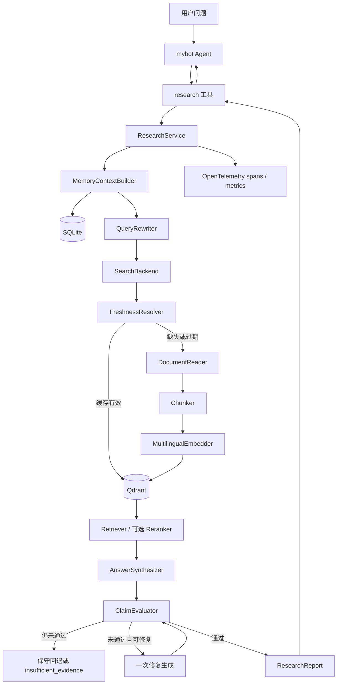

# 研究记忆、持久化 RAG、引用评估与可观测性设计

## 1. 文档状态

- 状态：Proposal
- 适用范围：`research_assistant` 领域服务及其与 `mybot` 的集成
- 目标读者：开发、测试、运维和项目评审人员
- 原则：先完成单机闭环，再保留远程服务化能力；所有外部依赖都通过端口注入

## 2. 背景与问题

当前系统已经完成一次性研究链路：搜索、网页读取、分块、本地 hashing embedding、
检索、答案生成和来源编号校验。现有 `MemoryStore` 会保存最近主题、查询词和来源，
但这些数据只用于记录，不参与后续查询改写、证据复用或检索排序。

当前主要缺口如下：

1. `HashingEmbedder` 主要依赖词面重合，跨语言、同义表达和长文本语义检索效果有限。
2. `VectorIndex` 只存在于单次请求内，已经抓取和向量化的证据无法复用。
3. 引用校验只能发现未知的 `[S99]`，无法判断某条 claim 是否真的被引用证据支持。
4. 缺少分阶段耗时、失败率、检索质量和引用质量指标，无法定位慢点或度量改进。
5. 历史记忆没有作用域、时效和来源版本，直接用于回答会形成旧证据或错误答案循环。

## 3. 目标与非目标

### 3.1 目标

1. 使用真正的多语言语义 embedding，并将文档向量持久化。
2. 支持来源去重、版本更新、时效校验和历史证据复用。
3. 让长期记忆辅助查询改写，但不把历史答案直接当作事实证据。
4. 对答案做 claim-level 引用覆盖率、一致性和矛盾检测。
5. 为每次研究建立可关联的 trace、结构化日志和低基数指标。
6. 保持 `ResearchService` 可测试、可离线运行，并允许未来迁移到远程向量数据库。

### 3.2 非目标

1. 第一阶段不引入跨进程 A2A；`mybot` 仍通过进程内 `research` 工具调用服务。
2. 不保证网页内容绝对真实，只保证来源、抓取版本、证据和答案之间可追踪。
3. 不在第一阶段实现自动训练或微调 embedding、reranker、NLI 模型。
4. 不用历史生成答案替代原始来源，也不永久缓存所有网页。

## 4. 核心架构决策

### 4.1 技术组合

| 能力 | 第一阶段选择 | 原因 |
| --- | --- | --- |
| 多语言 embedding | SentenceTransformers | 支持批量推理，以及 `encode_query` / `encode_document` 非对称检索接口 |
| 向量存储 | Qdrant Client 本地持久化模式 | 单机可用 `path` 落盘，API 与远程 Qdrant 基本一致，支持 payload 过滤 |
| 元数据存储 | SQLite | Python 自带驱动，适合事务化保存研究运行、查询、来源版本和评估结果 |
| 追踪与指标 | OpenTelemetry | 统一 trace、counter、histogram，并可导出到 Prometheus/OTLP |
| 引用验证 | 规则检查 + 可插拔 ClaimVerifier | 先保证确定性边界，再允许接入 NLI 或独立 LLM verifier |

Embedding 模型必须配置化。首个候选可以使用 `BAAI/bge-m3`，但上线默认值应由项目自己的
中英文检索集评测决定，而不是只根据公开榜单决定。集合维度从
`get_embedding_dimension()` 读取，不在代码中硬编码。

### 4.2 为什么同时使用 SQLite 和 Qdrant

Qdrant 负责“给定查询向量，找到相似 chunk”，SQLite 负责强一致的业务元数据：

- 一次研究运行的状态、参数和耗时；
- 查询改写历史和搜索结果；
- URL、内容哈希、抓取时间、过期时间和来源版本；
- claim 评估及其与证据的多对多关系；
- 数据迁移版本。

不要把运行状态全部塞入向量 payload，也不要用 SQLite 自行实现近邻检索。两个存储通过
稳定的 `document_version_id` 和 `chunk_id` 关联。

## 5. 目标调用链



## 6. 领域边界与接口

现有 `SearchBackend`、`DocumentReader`、`AnswerSynthesizer` 和
`ResearchRepository` 保留，新增以下端口：

```python
class Embedder(Protocol):
    @property
    def model_id(self) -> str: ...

    @property
    def dimensions(self) -> int: ...

    async def embed_documents(self, texts: list[str]) -> list[list[float]]: ...
    async def embed_query(self, text: str) -> list[float]: ...


class EvidenceIndex(Protocol):
    async def upsert(self, chunks: list[IndexedChunk]) -> None: ...
    async def search(self, request: RetrievalRequest) -> list[RetrievedChunk]: ...
    async def delete_document_version(self, document_version_id: str) -> None: ...


class MemoryRepository(Protocol):
    async def begin_run(self, request: ResearchRequest) -> ResearchRun: ...
    async def find_related_runs(self, topic: str, scope: MemoryScope) -> list[MemoryHit]: ...
    async def get_fresh_document(self, canonical_url: str, now: datetime) -> DocumentVersion | None: ...
    async def save_evaluation(self, evaluation: CitationEvaluation) -> None: ...


class QueryRewriter(Protocol):
    async def rewrite(self, request: QueryRewriteRequest) -> list[ResearchQuery]: ...


class ClaimVerifier(Protocol):
    async def verify(self, claim: AtomicClaim, evidence: list[Chunk]) -> ClaimVerdict: ...
```

`ResearchService` 只编排这些端口。SentenceTransformers、Qdrant、SQLite 和
OpenTelemetry 的具体对象由 `mybot.provider.research.create_research_service()` 注入。

## 7. 持久化数据模型

### 7.1 SQLite 表

#### `research_runs`

| 字段 | 说明 |
| --- | --- |
| `run_id` | UUID，整条链路和 trace 的业务关联键 |
| `session_id` / `user_scope` | 记忆隔离作用域，可为空 |
| `topic` | 原始主题 |
| `request_json` | 参数快照 |
| `status` | running / complete / insufficient_evidence / failed |
| `started_at` / `finished_at` | 生命周期 |
| `answer` | 最终答案，仅用于审计，不直接作为未来事实证据 |
| `quality_json` | 覆盖率、一致性、检索指标快照 |

#### `research_queries`

保存 `run_id`、原始 query、改写 query、改写原因、结果数量、耗时和错误类型。历史 query
只作为候选和效果反馈，不能因为“以前搜过”就跳过本次搜索。

#### `sources` 与 `document_versions`

- `sources`：规范化 URL、域名、来源类型、首次/最后发现时间。
- `document_versions`：`content_hash`、标题、语言、抓取时间、`expires_at`、HTTP 元数据、
  解析器版本、正文位置或压缩正文。
- 同一 URL 内容改变时新增版本，不覆盖旧版本，以保证历史报告可重放。

#### `claims`、`claim_citations` 与 `claim_evidence`

- `claims`：原子 claim、类型、重要度、是否需要外部验证。
- `claim_citations`：claim 明确引用了哪些 source id。
- `claim_evidence`：验证时使用的 chunk、verdict、置信度和 verifier 版本。

### 7.2 Qdrant point

Point ID 使用确定性 UUID：

```text
uuid5(namespace, embedding_model_version + document_version_id + chunk_index)
```

Payload 至少包含：

```json
{
  "chunk_id": "...",
  "document_version_id": "...",
  "source_id": "...",
  "canonical_url": "...",
  "title": "...",
  "language": "zh",
  "text": "...",
  "content_hash": "sha256:...",
  "fetched_at": "...",
  "expires_at": "...",
  "scope": "global|user|session",
  "embedding_model": "...",
  "chunker_version": "..."
}
```

过滤检索时至少检查 `scope`、`embedding_model`、有效版本和 `expires_at`。不要将
`session_id`、URL、topic 或 claim 文本作为指标标签，以免产生高基数时序数据。

## 8. 多语言 Embedding 与检索设计

### 8.1 Embedding 适配器

`SentenceTransformerEmbedder` 的行为要求：

1. 文档使用 `encode_document()`，查询使用 `encode_query()`。
2. 批量编码，默认 batch size 配置化。
3. 输出归一化向量；Qdrant collection 使用 cosine 距离。
4. 同步模型推理通过专用线程池或执行器运行，不能阻塞主事件循环。
5. 暴露模型名、revision、维度、归一化方式，组成 `embedding_version`。
6. 启动时验证 collection 向量维度与模型一致，不一致则拒绝写入。

### 8.2 Collection 版本策略

建议命名：

```text
research_chunks_{embedding_version_hash}
```

更换模型时创建新 collection，后台重新编码，然后切换逻辑 alias。不要把不同模型生成的
向量写进同一个 dense vector 空间。迁移完成前可以双写，但查询只能使用与 query 模型一致
的 collection。

### 8.3 检索流程

```text
原始主题 + 改写查询
→ 分别向量检索 top_n
→ 合并并按 chunk_id 去重
→ 每来源配额
→ 新鲜度/来源质量轻量加权
→ 可选 CrossEncoder rerank
→ MMR 去冗余
→ 最终 top_k
```

第一阶段先实现 dense retrieval，不立即加入 reranker。接口中预留 `Reranker`，等离线评测
证明 top-k recall 是主要瓶颈后再引入，避免无依据增加延迟。

## 9. 长期记忆参与查询和证据复用

### 9.1 三类记忆必须分开

| 记忆类型 | 内容 | 是否可直接作为证据 |
| --- | --- | --- |
| 会话记忆 | `mybot` 对话历史、用户当前意图 | 否 |
| 经历记忆 | 历史主题、有效 query、失败模式、偏好 | 否，只用于查询规划 |
| 证据记忆 | 带来源版本和抓取时间的 chunk | 是，但必须通过时效与作用域检查 |

最重要的约束是：历史 `answer` 永远不直接进入证据集合。它可以帮助识别用户后续问题，
但事实仍要回到可追踪的 `document_version` 和 chunk。

### 9.2 Query rewrite 输入

`MemoryContextBuilder` 最多提供：

- 当前 topic；
- 当前会话的短摘要，不发送完整长期会话；
- 相似历史主题及当时表现较好的查询；
- 用户明确保存的语言、来源类型或时间偏好；
- 已知失败查询，例如持续返回零结果的表达。

输出为结构化列表：

```json
[
  {"query": "...", "intent": "overview", "derived_from": "current_topic"},
  {"query": "...", "intent": "official", "derived_from": "historical_success"}
]
```

约束：单次最多 10 个 query；大小写和规范化后去重；历史 query 只影响排序，不禁止重新
执行；记录每个改写 query 最终找到的有效证据数，作为后续反馈。

### 9.3 历史证据复用规则

一个历史 chunk 只有同时满足以下条件才可复用：

1. memory scope 对当前用户/会话可见；
2. 来源 URL 和 document version 可追踪；
3. 未超过来源类型对应的 TTL；
4. embedding 和 chunker 版本仍兼容；
5. 当前查询检索分数达到阈值；
6. `refresh=True` 时不直接采用缓存版本，必须重新验证来源。

建议 TTL：官方静态文档 30 天、普通网页 7 天、新闻或高时效页面 6 小时。TTL 必须配置化，
并允许来源规则覆盖。过期证据可以帮助生成搜索词，但不能直接进入最终证据列表。

### 9.4 避免记忆反馈循环

- 不把模型生成的摘要重新嵌入为“来源证据”。
- 不因历史高分就永久提升某个来源；保留探索比例。
- 证据内容更新后生成新版本，历史报告继续指向旧版本。
- 用户要求删除记忆时，同时删除 SQLite 元数据、对应 scope 的向量 point 和正文。

## 10. Claim-level 引用评估

### 10.1 评估对象

先把答案拆成 atomic claims，而不是直接按整个段落评估。例如：

```text
原句：A 方法在 2025 年发布，并在数据集 B 上提升了 12% [S1]。

claim 1：A 方法在 2025 年发布。
claim 2：A 方法在数据集 B 上提升了 12%。
```

纯建议、主观表达和章节标题可以标为 `non_verifiable`；数字、时间、实体关系、比较和因果
陈述默认为 `verifiable`。

### 10.2 四步验证

1. **格式与绑定**：解析每个 claim 同句或紧邻位置的 `[Sx]`，拒绝未知 source id。
2. **证据召回**：优先取引用来源中的已检索 chunk；必要时在该 document version 内二次检索。
3. **支持性判断**：`ClaimVerifier` 返回 `entailed`、`partial`、`contradicted` 或
   `not_enough_information`，并记录置信度和证据片段。
4. **全局评分**：计算覆盖率、引用精确率、支持率和矛盾率。

建议先使用确定性规则处理未知引用、无引用和明显数字不一致；语义支持性由独立 verifier
判断。Verifier 不应读取模型的推理过程，只接收 claim 和有限证据。生产环境优先使用独立
NLI/CrossEncoder；如果首版使用 LLM verifier，必须结构化输出、低温度，并与生成模型的
结果分别记录，避免把一次自评当作绝对真值。

### 10.3 指标定义

令重要 claim 权重为 2，普通 factual claim 权重为 1：

```text
claim_coverage = 有合法引用的可验证 claim 权重 / 全部可验证 claim 权重

claim_support_rate = 被证据 entailed 的 claim 权重 / 已引用 claim 权重

citation_precision = 至少支持一个绑定 claim 的引用数 / 全部引用数

contradiction_rate = contradicted claim 权重 / 已验证 claim 权重
```

`partial` 可以按 0.5 计入支持率，但必须保留单独计数，不能伪装成完全支持。

### 10.4 决策门槛

建议首版门槛，最终由验证集校准：

- 未知引用或 contradiction：硬失败。
- `claim_coverage < 0.85`：触发一次修复。
- `claim_support_rate < 0.80`：触发一次修复。
- 修复后仍不达标：删除不受支持的 claim，或返回 `insufficient_evidence`。

修复提示只包含失败 claim、verdict 和允许使用的证据，并且最多执行一次，防止成本和延迟
失控。修复后必须重新完整评估，不能沿用旧评分。

### 10.5 报告扩展

`ResearchReport` 新增：

```python
@dataclass
class ResearchQuality:
    claim_coverage: float
    claim_support_rate: float
    citation_precision: float
    contradiction_rate: float
    evaluated_claims: int
    unsupported_claims: list[str]
    evaluator_version: str
```

外部默认只返回分数和不支持 claim 摘要；内部审计记录完整 claim-evidence 映射。

## 11. 可观测性设计

### 11.1 Trace

每次研究建立根 span `research.run`，子 span 如下：

```text
research.run
├── memory.load_context
├── query.rewrite
├── search.batch
│   └── search.query（每条 query）
├── source.resolve_freshness
├── read.batch
│   └── read.source（每个 URL）
├── chunk.documents
├── embedding.documents
├── vector.upsert
├── retrieval.query
├── generation.answer
├── citation.evaluate
└── memory.commit
```

Span attributes 只记录低基数或受控字段，例如 provider、模型、status、cache_hit、来源数量、
chunk 数量和 token 数。topic、完整 URL、答案、API Key、session_id 不进入公开 telemetry；
需要关联时使用不可逆哈希或仅在受控审计日志保存 `run_id`。

### 11.2 指标

| 指标 | 类型 | 关键属性 |
| --- | --- | --- |
| `research_runs_total` | Counter | status, refresh |
| `research_stage_duration_seconds` | Histogram | stage, provider, status |
| `research_search_results` | Histogram | provider |
| `research_read_total` | Counter | status, error_type |
| `research_cache_total` | Counter | hit/miss/stale |
| `research_chunks_indexed` | Counter | embedding_model |
| `research_retrieval_score` | Histogram | retrieval_version |
| `research_generation_total` | Counter | model, status, fallback |
| `research_claim_coverage` | Histogram | evaluator_version |
| `research_claim_support_rate` | Histogram | evaluator_version |
| `research_citation_failures_total` | Counter | reason |

错误属性使用枚举，例如 `timeout`、`dns`、`http_4xx`、`http_5xx`、`parse_empty`、
`model_error`，不要直接使用异常消息作为 label。

### 11.3 质量指标与运行指标分离

耗时、吞吐和失败率可以进入 Prometheus；单次 claim 明细和检索命中详情进入 SQLite 审计表。
指标用于发现趋势，审计数据用于解释某次结果，避免时序系统出现高基数。

### 11.4 建议 SLO

初期先观察两周再确定正式 SLO。用于开发验收的暂定目标：

- 非缓存研究 P95 总耗时小于 30 秒，不包含明确配置的超长模型调用。
- 有效缓存命中时 P95 小于 8 秒。
- 可读来源存在时，流水线技术失败率低于 2%。
- 测试集 claim coverage 不低于 0.90，claim support rate 不低于 0.85。
- 未知引用逃逸率为 0，私网 URL 放行率为 0。

## 12. 配置设计

```yaml
research:
  embedding:
    provider: sentence_transformers
    model: BAAI/bge-m3
    revision: null
    device: auto
    batch_size: 32
    normalize: true

  vector_store:
    provider: qdrant
    mode: local
    path: .research/qdrant
    url: null
    api_key: null
    collection_prefix: research_chunks

  metadata_store:
    url: sqlite:///.research/research.db

  retrieval:
    candidate_k: 30
    top_k: 8
    max_per_source: 2
    min_score: null
    reranker: null

  memory:
    enabled: true
    max_related_runs: 5
    default_ttl_hours: 168
    official_ttl_hours: 720
    volatile_ttl_hours: 6

  citation_evaluation:
    enabled: true
    verifier: configurable
    min_coverage: 0.85
    min_support_rate: 0.80
    max_repairs: 1

  telemetry:
    enabled: true
    service_name: mybot-research
    otlp_endpoint: null
    prometheus_port: 9464
```

密钥继续使用 `${ENV_VAR}` 解析。模型下载目录和 Qdrant 路径必须在 workspace 或显式允许的
数据目录内。

## 13. 对现有代码的修改映射

| 文件或新模块 | 修改内容 |
| --- | --- |
| `research_assistant/ports.py` | 增加 Embedder、EvidenceIndex、MemoryRepository、ClaimVerifier |
| `research_assistant/models.py` | 增加 DocumentVersion、AtomicClaim、ClaimVerdict、ResearchQuality |
| `research_assistant/embeddings.py` | 保留 HashingEmbedder 测试实现，新增 SentenceTransformer 适配器 |
| `research_assistant/rag.py` | 将内存 VectorIndex 降为测试实现，编排依赖 EvidenceIndex |
| `research_assistant/vectorstores/qdrant.py` | collection 管理、upsert、过滤查询、版本检查 |
| `research_assistant/repositories/sqlite.py` | schema migration、事务和元数据查询 |
| `research_assistant/memory_context.py` | 作用域过滤、相似历史运行和 freshness 逻辑 |
| `research_assistant/query_rewriter.py` | 结构化查询改写及去重 |
| `research_assistant/claims.py` | claim 抽取、引用绑定、验证和评分 |
| `research_assistant/telemetry.py` | spans、metrics 和属性清洗 |
| `research_assistant/service.py` | 新流水线编排、一次修复和统一提交状态 |
| `mybot/provider/research.py` | 根据 Config 注入上述实现 |
| `mybot/utils/config.py` | 增加 ResearchConfig 及校验 |

## 14. 分阶段实施

### Phase 0：基线与评测集

1. 建立至少 50 个中英文查询，包含跨语言、同义词、数字、时间和证据不足样例。
2. 标注 query 与相关 chunk、答案原子 claim 和支持证据。
3. 记录当前 hashing 实现的 Recall@k、MRR、总耗时和引用质量。

没有基线就无法证明更换模型和数据库带来真实收益。

### Phase 1：持久化语义检索

1. 引入 Embedder 与 EvidenceIndex 端口。
2. 实现 SentenceTransformers 批量编码和 Qdrant 本地 collection。
3. 增加 content hash、document version、TTL 和幂等 upsert。
4. 保留 HashingEmbedder/InMemoryVectorIndex 用于快速单元测试。
5. 对比新旧检索 Recall@k 和延迟，通过配置灰度切换。

### Phase 2：长期记忆闭环

1. 将 JSON MemoryStore 迁移到 SQLite；迁移脚本必须可重复执行。
2. 实现 memory scope、query history、历史证据 freshness 检查。
3. 实现查询改写和缓存命中路径。
4. 让 `refresh` 真正绕过直接证据复用，并写入新版本。

### Phase 3：Claim-level 评估

1. 先完成确定性的引用绑定、未知引用和 coverage 计算。
2. 接入 ClaimVerifier，保存 verifier 版本和逐 claim 结果。
3. 实现最多一次修复及失败后的保守降级。
4. 用人工标注集校准阈值，报告 verifier 的 precision/recall，而非只看平均分。

### Phase 4：可观测性与运行优化

1. 添加研究根 span 和所有阶段 span。
2. 添加低基数指标与结构化错误分类。
3. 建立延迟、失败率、缓存率和引用质量 Dashboard。
4. 根据数据决定是否加入 reranker、远程 Qdrant、缓存预热或独立研究 Worker。

## 15. 测试与验收

### 15.1 单元测试

- query/document 使用不同编码入口，向量维度和归一化正确。
- 相同 document version 重复写入不增加 point；内容变化产生新版本。
- scope、TTL、refresh 和 embedding version 过滤正确。
- 历史答案不会出现在 evidence 列表。
- claim 拆分、引用绑定、未知引用、partial 和 contradiction 评分正确。
- telemetry 不记录 topic、完整 URL、密钥和高基数异常消息。

### 15.2 集成测试

- 临时目录中的本地 Qdrant 关闭并重开后仍可检索。
- SQLite 提交失败时，run 标记失败且不会返回半完成报告。
- 更新 embedding 模型时新 collection 与旧 collection 隔离。
- 缓存命中、缓存过期和 `refresh=True` 三条路径都可重放。
- LLM 返回不支持 claim 时最多修复一次，并产生对应指标。

### 15.3 离线质量测试

- Retrieval：Recall@5、Recall@10、MRR、nDCG@10。
- Query rewrite：有效来源数提升、零结果率、额外搜索成本。
- Claim verifier：entailed/contradicted/NEI 的 precision、recall、F1。
- End-to-end：claim coverage、support rate、citation precision、人工可接受率。

### 15.4 发布门禁

- 现有 18 个测试继续通过。
- 新增迁移、持久化、作用域、引用评估和 telemetry 测试。
- 未知引用、过期证据、跨用户 memory 泄漏和私网 URL 测试必须全部通过。
- 新检索器在中英文验证集上的 Recall@10 明显优于 hashing 基线，否则不切默认配置。

## 16. 风险与应对

| 风险 | 应对 |
| --- | --- |
| 本地模型增加安装体积和冷启动 | 可选依赖组、延迟加载、模型缓存和健康检查 |
| Qdrant 本地模式不适合多进程共享 | 单机模式限制单写进程；多 Worker 时迁移远程 Qdrant |
| 网页变化造成旧证据 | 文档版本、TTL、refresh 和报告固定版本引用 |
| Query rewrite 放大搜索成本 | query 数量上限、历史效果反馈、每 run 预算 |
| Verifier 误判 | 人工标注集校准、保留 verdict 明细、低置信度不做硬删除 |
| 相同模型生成并验证导致偏差 | 独立 verifier、确定性检查优先、记录模型和版本 |
| 指标标签泄露或高基数 | allowlist 属性、哈希关联、详细数据只存审计库 |
| 历史记忆跨用户泄露 | 强制 scope filter，默认 session/user 隔离，显式数据删除 |

## 17. 最终验收场景

用户第一次研究“中英文 RAG 评估方法”时，系统抓取并持久化来源版本和向量；第二次在有效
TTL 内提出同义问题，系统能够命中历史证据，同时仍可根据查询改写补充新来源。答案中的每
个重要 factual claim 都能映射到具体来源版本和 chunk，并显示 coverage/support 指标。

当来源过期、用户要求 refresh、引用与证据矛盾、模型生成未知来源、搜索失败或 verifier
不可用时，系统有确定的刷新、修复、降级和告警路径。运维人员可以通过同一个 `run_id`
查看搜索、读取、embedding、检索、生成和引用评估各阶段耗时，而不会在 telemetry 中暴露
用户问题或来源正文。

## 18. 参考资料

- [Qdrant Python Client](https://github.com/qdrant/qdrant-client)：本地持久化、异步客户端、upsert、query 和 payload filter。
- [SentenceTransformers](https://github.com/huggingface/sentence-transformers)：`encode_query`、`encode_document`、批量和归一化 embedding。
- [OpenTelemetry Python](https://github.com/open-telemetry/opentelemetry-python)：tracing、metrics 与 Prometheus/OTLP exporter。
